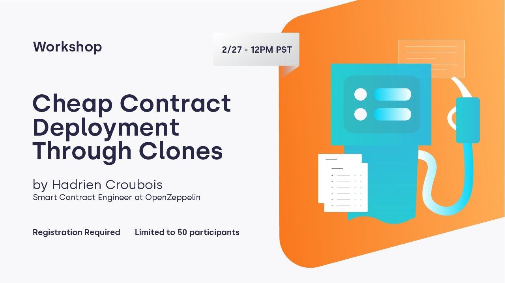

# [**Cheap Contract Deployment Through Clones**](https://youtu.be/3Mw-pMmJ7TA)

----

## [00:05](https://youtu.be/3Mw-pMmJ7TA?t=5) Introduction and Workshop Purpose

**Section Overview**: The speaker introduces the workshop as part of a series on contracts and discusses the purpose of addressing the needs of the community and providing tutorials. The focus of this workshop is to explore the new "clones" library in version 3.4 of the contract report.

## Workshop Introduction

- OpenZepin's mission is to protect the open economy and provide tooling for building secure apps.
- OpenZepin consists of three components: contract security, monitoring with Defender, and an audit team.
- The workshop aims to address the needs of developers working with families of smart contracts.
- The speaker encourages participants to consider OpenZepin for audits and managing decentralized applications.

# [02:10](https://youtu.be/3Mw-pMmJ7TA?t=130) Understanding Clone Feature

Section Overview: This section highlights some existing smart contract families that could benefit from using clone features, such as Uniswap and Argent. It emphasizes the cost-effectiveness and scalability advantages offered by clone features.

## Examples of Smart Contract Families

- Uniswap Version 2 has over 20,000 registered liquidity pairs, making it a suitable example for clone features.
- Liquidity pairs in Uniswap are smart contracts that facilitate asset exchange between tokens.
- Argent is a mobile-based smart wallet that integrates with DeFi protocols and offers programmable security mechanisms.
- Both Uniswap and Argent have seen significant adoption, resulting in numerous smart contracts being deployed on-chain.
  
# [05:02](https://youtu.be/3Mw-pMmJ7TA?t=302) Cost Considerations for Deploying Smart Contracts

Section Overview: This section discusses the cost implications associated with deploying smart contracts, particularly liquidity pairs in Uniswap. It highlights how high deployment costs can limit further adoption for tokens with low trading volumes.

## Deployment Costs for Liquidity Pairs

- Deploying a liquidity pair in Uniswap can cost over 500 USD due to gas fees.
- While it may be cost-effective for high-volume trading pairs, deploying new ERC20 tokens can be expensive.
- The high deployment costs may hinder the adoption of Uniswap for tokens with low trading volumes.

Note: The transcript does not provide further sections or timestamps.
# [t=391s] The Cost of Deploying Smart Contracts

Section Overview: This section discusses the high cost associated with deploying smart contracts and introduces the concept of using a clone library to reduce deployment expenses.

## Why is it Expensive to Deploy a Smart Contract?

- Deploying a smart contract costs over 200 dollars, which includes paying gas fees for each new user onboarding.
- The expense arises from storing data on-chain, as storage is the most costly aspect of creating a new smart contract.
- The cost of deploying a smart contract is proportional to the square of its bytecode size.
- Running the constructor, which sets variables and stores values, adds to the overall expense.

## Using Proxies for Cost Reduction

- Proxies offer interesting use cases such as upgradability and cost reduction.
- By deploying a new proxy instead of a brand new wallet for each user, Origens reduces deployment costs.
- However, proxies require reading the implementation address from storage before delegating transactions, adding execution costs.

## Introducing Clone Mechanism (EIP1167)

- Clones are smaller versions of proxies without features like upgradability but with lower deployment costs.
- Clones do not have constructors and their bytecode includes the logic's address directly, eliminating the need for storage reading during delegation.
- Clones provide better efficiency than proxies and are less expensive to deploy.

# [t=634s] Understanding Clone Mechanism

Section Overview: This section provides further details about clone mechanism (EIP1167) and highlights its advantages over proxies in terms of efficiency and deployment costs.

## Key Features of Clones

- Clones are also known as minimal proxies due to their small size and lack of constructors.
- When deploying clones, the logic's address is built into their bytecode, eliminating storage reading during delegation.
- While clones are not as efficient as standalone smart contracts when making direct calls, they are still more efficient than proxies.
- Clones have lower deployment costs due to their minimal bytecode size.

# [t=725s] Examples and Resources

Section Overview: This section provides links to code examples and additional resources for further exploration of the clone mechanism.

## Code Examples and Resources

- A link is provided to a repository containing code examples related to the workshop on clone mechanism.
- The repository offers resources for all workshops conducted by Open Zone.

Note: Please refer to the provided timestamps in the transcript for accurate navigation through the video.
# [t=0:12:51s] Naive Factory for Creating ERC20 Tokens

Section Overview: In this section, the speaker introduces a naive factory for creating ERC20 tokens. They explain that this factory is capable of creating only one type of token, specifically r620 tokens.

## Naive Factory Implementation

- The factory is simple and easy to understand.
- It creates ERC20 tokens with a specified name, symbol, initial supply, and owner.
- The creation process involves calling the `initialize` function with the selected parameters.
- This approach is expensive as it deploys a new smart contract containing the entire logic each time a token is created.

# [t=0:13:10s] OpenZeppelin's Contract Upgradable Package

Section Overview: The speaker discusses OpenZeppelin's contract upgradable package and its usage in deploying RC20 tokens.

## Using OpenZeppelin's Contract Upgradable Package

- OpenZeppelin provides presets for building upgradable contracts.
- The contract upgradable package offers a variation of the familiar contract structure where the constructor is replaced with an `initialized` function.
- This allows for contracts with an initializing mechanism, which can be useful when building contracts used with upgradability scripts and packages like Hardhat.

# [t=0:14:14s] Proxy Factory for Upgradable Tokens

Section Overview: The speaker introduces a proxy factory as an alternative to the naive factory for creating upgradable ERC20 tokens.

## Proxy Factory Implementation

- The proxy factory deploys an initial version acting as a template called "token implementation."
- When users want to create a token, instead of deploying a new ERC20 contract, they create an upgradable proxy.
- The proxy receives the address of the token implementation and an encoded version of the initialize function selector.
- This allows for atomic deployment and initialization of contracts without redeploying the entire ERC20 logic.
- The proxy deployment is less expensive than the naive factory but still more expensive than using a clone mechanism.

# [t=0:15:58s] Clone Factory for Non-Upgradable Tokens

Section Overview: The speaker discusses the clone factory as an alternative to the proxy factory for creating non-upgradable ERC20 tokens.

## Clone Factory Implementation

- The clone factory is used when upgradability mechanisms are not required.
- It deploys a clone of the token implementation and separately calls the initialize function.
- This approach is simpler and cheaper, as deploying a clone does not execute any code.

# [t=0:17:00s] Gas Consumption Comparison

Section Overview: The speaker compares the gas consumption of different token creation methods using a test scenario.

## Gas Consumption Analysis

- A test scenario is run to deploy RC20 tokens using various factories and perform transfer operations.
- Eth gas reporter module provides information about gas consumption.
- The naive implementation has the lowest deployment cost since it only includes the code of the RC20 tokens.
- Both the clone and proxy implementations require additional code in their constructors, resulting in higher deployment costs.
- Deploying the factory itself incurs its own deployment cost, which should be considered when evaluating overall gas consumption.
# [t=1137s] Understanding the Cost of Using Proxies and Clones

Section Overview: In this section, the speaker discusses the cost implications of using proxies and clones in smart contract development.

## Proxy vs. Clone

- [18:57](https://youtu.be/3Mw-pMmJ7TA?t=1137) When using a proxy instead of deploying a new contract, the cost is divided by approximately four.
- [19:21](https://youtu.be/3Mw-pMmJ7TA?t=1161) By using a clone with the factory clone, the cost further decreases to 200,000 gas.
- [19:39](https://youtu.be/3Mw-pMmJ7TA?t=1179) The security remains the same whether using a proxy or clone since there is no lack of security in either approach.

## Cost Comparison

- [19:58](https://youtu.be/3Mw-pMmJ7TA?t=1198) The deployment cost for a new contract is highest with the "knight" approach but becomes cheaper when making calls directly to the logic.
- [20:40](https://youtu.be/3Mw-pMmJ7TA?t=1240) Using a proxy incurs additional gas costs due to reading from storage to delegate code execution.
- [21:03](https://youtu.be/3Mw-pMmJ7TA?t=1263) While deployment may be more expensive initially, usage becomes less expensive over time.
- [21:42](https://youtu.be/3Mw-pMmJ7TA?t=1302) Clones are cheaper than proxies for both deployment and usage unless additional mechanisms like upgradeability are required.

# [t=1323s] Choosing Between Proxy and Clone

Section Overview: This section explores factors to consider when deciding between using proxies or clones in smart contract development.

## Factors Influencing Choice

- [22:03](https://youtu.be/3Mw-pMmJ7TA?t=1323) If there is no need for upgradability or splitting calls between different implementations, clones are recommended over proxies.
- [22:24](https://youtu.be/3Mw-pMmJ7TA?t=1344) Proxies have additional features that may be useful in certain cases but are not necessary if only delegating logic to a single endpoint.

# [t=1363s] Direct Clone Implementation

Section Overview: This section discusses how UniSwap developers could have implemented direct cloning.

## UniSwap V2 Factory Code

- [22:43](https://youtu.be/3Mw-pMmJ7TA?t=1363) The UniSwap V2 Factory code includes a "createPair" function responsible for creating pairs.
- [23:06](https://youtu.be/3Mw-pMmJ7TA?t=1386) Forking the code and making a few changes would allow for direct cloning using the "cloneDeterministic" function.

# [t=1446s] Cost Comparison with Direct Clone Implementation

Section Overview: This section compares the deployment of a UniSwap pair using both the original implementation and a modified version that uses clones.

- [24:06](https://youtu.be/3Mw-pMmJ7TA?t=1446) The modified version achieves the same functionality as the original UniSwap pair but at a lower cost due to using clones.
# [t=1508s] Cost Comparison: Creating a Pair

Section Overview: In this section, the speaker discusses the cost difference between creating a pair in different scenarios.

## Cost of Creating a Pair

- In the current scenario, creating a pair costs about 2 million gas.
- This cost is lower than the previously mentioned 2.5 million gas due to different optimization mechanisms.
- Moving from the current uniform code to a clone version can save almost ninety percent of gas, reducing the cost to about two hundred thousand gas.
- However, using a clone version may result in slightly higher expenses when calling the pair for swaps.

# [t=1525s] Benefits of Using Clones

Section Overview: The speaker explains the advantages of using clones instead of uniform code.

## Gas Savings with Clones

- Using clones can save up to ninety percent of gas compared to uniform code.
- For example, in UniSwap, deploying a wallet factory clone would be around 60,000 gas cheaper than their current implementation.
- These savings can be significant for platforms like Argent and reduce costs for users and transactions.

# [t=1569s] Similarities Between Code Versions

Section Overview: The speaker compares code versions between Argent and their modified version.

## Code Similarities

- The modified version closely resembles Argent's latest code from their GitHub repository.
- Only minor modifications were made, such as changing contract names and adding control fracture functionality.
- Both versions use clone deterministic for control fracture deployment but differ in how they predict addresses.

# [t=1612s] Functionality Comparison: Proxy vs Clone

Section Overview: The speaker compares functionality between proxy and clone implementations.

## Differences in Functionality

- Argent uses proxies while their modified version uses clones.
- The main difference lies in how they create proxies or clones using salt syntax or predict deterministic address functions.
- The modified version offers a simpler and more efficient way to predict clone addresses.

# [t=1673s] Gas Cost Comparison: Wallet Factory

Section Overview: The speaker compares the gas cost of deploying a wallet factory in different scenarios.

## Gas Cost of Wallet Factory

- Argent's current implementation of the wallet factory costs around 300,000 gas to deploy.
- By using a wallet factory clone, they could save approximately 60,000 gas per new user's wallet deployment.
- These savings can be significant for platforms like Argent and reduce overall usage costs.

# [t=1736s] Introduction to Clones Library

Section Overview: The speaker introduces the clones library and its functions.

## Clones Library Functions

- The clones library is available in OpenZeppelin's proxy repository.
- It provides functions such as `clone` for creating new clones using the create mechanism, which always succeeds without reverting.
- Another function called `clone deterministic` is used for control fracture mechanisms like UniSwap or Argent. It requires a unique salt value to avoid issues.
- There is also a `predict deterministic address` function that allows predicting the address of a clone if another contract wants to deploy it.

# [t=1796s] Summary and Benefits of Using Clones

Section Overview: The speaker summarizes the benefits of using clones and their cost-saving potential.

## Cost Savings with Clones

- Moving from basic contracts to clones offers significant gas savings compared to proxy contracts.
- For example, deploying a new UniSwap pair or an Argent control fractal wallet with clones can result in substantial cost reductions.
- These savings are particularly beneficial for platforms like Argent, reducing costs for both users and platform operators.
# [31:11](https://youtu.be/3Mw-pMmJ7TA?t=1871)

Section Overview: This section discusses the advantages and drawbacks of using clones instead of proxies in smart contracts, focusing on gas savings and upgradability limitations.

## Advantages of Clones

- Clones require only one line to change when transitioning from proxies, making it easier to switch.
- Clones save a small amount of gas compared to proxies when calling the contract.
- Gas savings become more significant with the upcoming network upgrade in April that will increase storage reading costs.

## Limitations of Clones

- Clones are not upgradable, which is considered a security feature but also a limitation.
- If upgradability is needed, clones cannot be used. However, this may not be an issue for certain cases like Origin wallets, which are upgradable through delegation to a contract with modular mechanisms.

## Cost Considerations

- Calling a native contract is cheaper than using clones. UniSwap chose not to use clones for deploying pairs like ETH vs USDC due to additional costs per call.
- For less frequently used contracts, the initial deployment cost may justify accepting the additional fee per call.

## Additional Resources

- OpenZepplin's "Initializable" mechanism with clones or proxies can be explored further in their repository.
  - [Cheap Contract Deployment Through Clones](https://youtu.be/3Mw-pMmJ7TA?t=-1)
  - [Forum](https://forum.openzeppelin.com/)

- When deploying and monitoring applications, consider using Defender as a helpful tool.

[33:15](https://youtu.be/3Mw-pMmJ7TA?t=1995)

[Generated with Video Highlight](https://videohighlight.com/video/summary/3Mw-pMmJ7TA)

----

## Transcript

- [00:00:04](https://youtu.be/xqRmTx-hBUo?t=4) ➜ okay
- [00:00:05](https://youtu.be/xqRmTx-hBUo?t=5) ➜ so hello everyone uh hello for the
- [00:00:08](https://youtu.be/xqRmTx-hBUo?t=8) ➜ newcomers here uh
- [00:00:10](https://youtu.be/xqRmTx-hBUo?t=10) ➜ this is i think the first of a series of
- [00:00:12](https://youtu.be/xqRmTx-hBUo?t=12) ➜ workshops on on contracts
- [00:00:14](https://youtu.be/xqRmTx-hBUo?t=14) ➜ there already have been a few workshops
- [00:00:16](https://youtu.be/xqRmTx-hBUo?t=16) ➜ for for defender
- [00:00:17](https://youtu.be/xqRmTx-hBUo?t=17) ➜ and this is part of an effort to to
- [00:00:20](https://youtu.be/xqRmTx-hBUo?t=20) ➜ address the needs of the community and
- [00:00:21](https://youtu.be/xqRmTx-hBUo?t=21) ➜ to speak
- [00:00:22](https://youtu.be/xqRmTx-hBUo?t=22) ➜ more publicly about how you can use it
- [00:00:24](https://youtu.be/xqRmTx-hBUo?t=24) ➜ provide tutorials
- [00:00:25](https://youtu.be/xqRmTx-hBUo?t=25) ➜ and today the subject of these tutorials
- [00:00:28](https://youtu.be/xqRmTx-hBUo?t=28) ➜ is to
- [00:00:28](https://youtu.be/xqRmTx-hBUo?t=28) ➜ to deal with the new to work with the
- [00:00:30](https://youtu.be/xqRmTx-hBUo?t=30) ➜ new clones library
- [00:00:31](https://youtu.be/xqRmTx-hBUo?t=31) ➜ that you may have seen uh appeared on
- [00:00:34](https://youtu.be/xqRmTx-hBUo?t=34) ➜ the on the contract report with version
- [00:00:36](https://youtu.be/xqRmTx-hBUo?t=36) ➜ 3.4
- [00:00:37](https://youtu.be/xqRmTx-hBUo?t=37) ➜ lately and and see how it can be useful
- [00:00:39](https://youtu.be/xqRmTx-hBUo?t=39) ➜ uh
- [00:00:40](https://youtu.be/xqRmTx-hBUo?t=40) ➜ so here on the on the first slide you'll
- [00:00:43](https://youtu.be/xqRmTx-hBUo?t=43) ➜ see a link
- [00:00:44](https://youtu.be/xqRmTx-hBUo?t=44) ➜ zpl dot in slash contracts dash workshop
- [00:00:48](https://youtu.be/xqRmTx-hBUo?t=48) ➜ uh this will be repeated later in the
- [00:00:51](https://youtu.be/xqRmTx-hBUo?t=51) ➜ in the in this in the slides uh but it's
- [00:00:54](https://youtu.be/xqRmTx-hBUo?t=54) ➜ basically where you can find all the
- [00:00:55](https://youtu.be/xqRmTx-hBUo?t=55) ➜ code that
- [00:00:56](https://youtu.be/xqRmTx-hBUo?t=56) ➜ that was used and will be shown during
- [00:00:59](https://youtu.be/xqRmTx-hBUo?t=59) ➜ this workshop to produce metrics or if
- [00:01:01](https://youtu.be/xqRmTx-hBUo?t=61) ➜ you want to
- [00:01:02](https://youtu.be/xqRmTx-hBUo?t=62) ➜ to have a look at how it can be useful
- [00:01:04](https://youtu.be/xqRmTx-hBUo?t=64) ➜ uh this is
- [00:01:05](https://youtu.be/xqRmTx-hBUo?t=65) ➜ this is the place to go
- [00:01:08](https://youtu.be/xqRmTx-hBUo?t=68) ➜ okay so first i'd like to speak very
- [00:01:11](https://youtu.be/xqRmTx-hBUo?t=71) ➜ briefly about about
- [00:01:12](https://youtu.be/xqRmTx-hBUo?t=72) ➜ our mission at open zapin our mission is
- [00:01:14](https://youtu.be/xqRmTx-hBUo?t=74) ➜ very important it's about
- [00:01:15](https://youtu.be/xqRmTx-hBUo?t=75) ➜ protecting the open economy and and the
- [00:01:18](https://youtu.be/xqRmTx-hBUo?t=78) ➜ security part of of
- [00:01:19](https://youtu.be/xqRmTx-hBUo?t=79) ➜ conduction is very important so you can
- [00:01:22](https://youtu.be/xqRmTx-hBUo?t=82) ➜ see it in the smartphone try to try to
- [00:01:23](https://youtu.be/xqRmTx-hBUo?t=83) ➜ provide we try to provide tooling
- [00:01:25](https://youtu.be/xqRmTx-hBUo?t=85) ➜ so that you can build secured apps uh
- [00:01:28](https://youtu.be/xqRmTx-hBUo?t=88) ➜ but that's not the
- [00:01:29](https://youtu.be/xqRmTx-hBUo?t=89) ➜ all the entire extent of it uh open
- [00:01:32](https://youtu.be/xqRmTx-hBUo?t=92) ➜ zapping is also
- [00:01:33](https://youtu.be/xqRmTx-hBUo?t=93) ➜ about the defender park that we
- [00:01:35](https://youtu.be/xqRmTx-hBUo?t=95) ➜ discussed a bit before the workshop
- [00:01:37](https://youtu.be/xqRmTx-hBUo?t=97) ➜ that providing tooling for you to
- [00:01:38](https://youtu.be/xqRmTx-hBUo?t=98) ➜ monitor your smart contracts
- [00:01:40](https://youtu.be/xqRmTx-hBUo?t=100) ➜ to react to events that happen on chain
- [00:01:43](https://youtu.be/xqRmTx-hBUo?t=103) ➜ but it's also the security team of open
- [00:01:46](https://youtu.be/xqRmTx-hBUo?t=106) ➜ zapping
- [00:01:46](https://youtu.be/xqRmTx-hBUo?t=106) ➜ that is leading in in the audit space
- [00:01:50](https://youtu.be/xqRmTx-hBUo?t=110) ➜ and so the idea is that with this three
- [00:01:52](https://youtu.be/xqRmTx-hBUo?t=112) ➜ component of the company
- [00:01:55](https://youtu.be/xqRmTx-hBUo?t=115) ➜ you should find everything you need for
- [00:01:58](https://youtu.be/xqRmTx-hBUo?t=118) ➜ securing your infrastructure
- [00:02:00](https://youtu.be/xqRmTx-hBUo?t=120) ➜ your decentralized application and
- [00:02:01](https://youtu.be/xqRmTx-hBUo?t=121) ➜ having all the tools you need
- [00:02:03](https://youtu.be/xqRmTx-hBUo?t=123) ➜ so so think about open zipping not only
- [00:02:05](https://youtu.be/xqRmTx-hBUo?t=125) ➜ when you build contracts but also
- [00:02:07](https://youtu.be/xqRmTx-hBUo?t=127) ➜ later when you build your application if
- [00:02:09](https://youtu.be/xqRmTx-hBUo?t=129) ➜ you need audits if you if you want to
- [00:02:11](https://youtu.be/xqRmTx-hBUo?t=131) ➜ manage your your decentralized
- [00:02:12](https://youtu.be/xqRmTx-hBUo?t=132) ➜ application
- [00:02:13](https://youtu.be/xqRmTx-hBUo?t=133) ➜ uh open zapping has to link for that
- [00:02:17](https://youtu.be/xqRmTx-hBUo?t=137) ➜ so our subject today is is a clone
- [00:02:20](https://youtu.be/xqRmTx-hBUo?t=140) ➜ feature and this feature is particularly
- [00:02:22](https://youtu.be/xqRmTx-hBUo?t=142) ➜ useful
- [00:02:23](https://youtu.be/xqRmTx-hBUo?t=143) ➜ when you are dealing with families of
- [00:02:26](https://youtu.be/xqRmTx-hBUo?t=146) ➜ smart contracts which might be your case
- [00:02:27](https://youtu.be/xqRmTx-hBUo?t=147) ➜ in your application
- [00:02:29](https://youtu.be/xqRmTx-hBUo?t=149) ➜ and so first we'll think about a few
- [00:02:31](https://youtu.be/xqRmTx-hBUo?t=151) ➜ families of smart contracts out there
- [00:02:33](https://youtu.be/xqRmTx-hBUo?t=153) ➜ that exist that are used every day and
- [00:02:35](https://youtu.be/xqRmTx-hBUo?t=155) ➜ that could benefit from these chrome
- [00:02:37](https://youtu.be/xqRmTx-hBUo?t=157) ➜ features
- [00:02:38](https://youtu.be/xqRmTx-hBUo?t=158) ➜ the first one is uniswap uh uni swap
- [00:02:42](https://youtu.be/xqRmTx-hBUo?t=162) ➜ in the version 2 which is the current
- [00:02:44](https://youtu.be/xqRmTx-hBUo?t=164) ➜ version has over 20 000 register per
- [00:02:47](https://youtu.be/xqRmTx-hBUo?t=167) ➜ earth so that means that there are 20
- [00:02:49](https://youtu.be/xqRmTx-hBUo?t=169) ➜ 000 uh
- [00:02:50](https://youtu.be/xqRmTx-hBUo?t=170) ➜ liquidity pairs for the uniform protocol
- [00:02:53](https://youtu.be/xqRmTx-hBUo?t=173) ➜ and
- [00:02:54](https://youtu.be/xqRmTx-hBUo?t=174) ➜ for those that may not be familiar with
- [00:02:55](https://youtu.be/xqRmTx-hBUo?t=175) ➜ it how uniswap works is
- [00:02:57](https://youtu.be/xqRmTx-hBUo?t=177) ➜ there is a component that is called the
- [00:02:59](https://youtu.be/xqRmTx-hBUo?t=179) ➜ water router that
- [00:03:01](https://youtu.be/xqRmTx-hBUo?t=181) ➜ is useful to to build complex operation
- [00:03:04](https://youtu.be/xqRmTx-hBUo?t=184) ➜ of trading but
- [00:03:05](https://youtu.be/xqRmTx-hBUo?t=185) ➜ behind this water what happens is there
- [00:03:07](https://youtu.be/xqRmTx-hBUo?t=187) ➜ are liquidity pairs
- [00:03:08](https://youtu.be/xqRmTx-hBUo?t=188) ➜ and liquidity pers are just smart
- [00:03:10](https://youtu.be/xqRmTx-hBUo?t=190) ➜ contracts that
- [00:03:12](https://youtu.be/xqRmTx-hBUo?t=192) ➜ knows about two token for example it
- [00:03:14](https://youtu.be/xqRmTx-hBUo?t=194) ➜ could be dye
- [00:03:15](https://youtu.be/xqRmTx-hBUo?t=195) ➜ and usdc and a liquidity pair
- [00:03:18](https://youtu.be/xqRmTx-hBUo?t=198) ➜ just contain an equal proportion of both
- [00:03:21](https://youtu.be/xqRmTx-hBUo?t=201) ➜ assets
- [00:03:22](https://youtu.be/xqRmTx-hBUo?t=202) ➜ and has the capability of exchanging
- [00:03:24](https://youtu.be/xqRmTx-hBUo?t=204) ➜ between one and the other
- [00:03:25](https://youtu.be/xqRmTx-hBUo?t=205) ➜ and so you have a liquidity pair for
- [00:03:28](https://youtu.be/xqRmTx-hBUo?t=208) ➜ let's say
- [00:03:29](https://youtu.be/xqRmTx-hBUo?t=209) ➜ wrapped ease and die and you have
- [00:03:31](https://youtu.be/xqRmTx-hBUo?t=211) ➜ another for die and usdc
- [00:03:33](https://youtu.be/xqRmTx-hBUo?t=213) ➜ and you might have another for usdc
- [00:03:35](https://youtu.be/xqRmTx-hBUo?t=215) ➜ versus i don't know like a
- [00:03:37](https://youtu.be/xqRmTx-hBUo?t=217) ➜ maker and so you can change those with a
- [00:03:39](https://youtu.be/xqRmTx-hBUo?t=219) ➜ routing mechanism but behind that
- [00:03:41](https://youtu.be/xqRmTx-hBUo?t=221) ➜ but i think this is pair and whenever
- [00:03:43](https://youtu.be/xqRmTx-hBUo?t=223) ➜ you want to put a new asset
- [00:03:45](https://youtu.be/xqRmTx-hBUo?t=225) ➜ on this map it's completely open and
- [00:03:47](https://youtu.be/xqRmTx-hBUo?t=227) ➜ decentralized you just have to create a
- [00:03:49](https://youtu.be/xqRmTx-hBUo?t=229) ➜ pair
- [00:03:49](https://youtu.be/xqRmTx-hBUo?t=229) ➜ and provide the quality for adapter and
- [00:03:51](https://youtu.be/xqRmTx-hBUo?t=231) ➜ this obviously happened a lot
- [00:03:53](https://youtu.be/xqRmTx-hBUo?t=233) ➜ and this system is very successful in
- [00:03:56](https://youtu.be/xqRmTx-hBUo?t=236) ➜ that extent
- [00:03:58](https://youtu.be/xqRmTx-hBUo?t=238) ➜ another system that that is interesting
- [00:04:00](https://youtu.be/xqRmTx-hBUo?t=240) ➜ to have a look at it's
- [00:04:01](https://youtu.be/xqRmTx-hBUo?t=241) ➜ urgent uh origin for those that don't
- [00:04:04](https://youtu.be/xqRmTx-hBUo?t=244) ➜ know about it
- [00:04:05](https://youtu.be/xqRmTx-hBUo?t=245) ➜ is a mobile based uh smart wallet that
- [00:04:07](https://youtu.be/xqRmTx-hBUo?t=247) ➜ allows you to allows you to hold
- [00:04:10](https://youtu.be/xqRmTx-hBUo?t=250) ➜ uh any erc20 or rc721
- [00:04:13](https://youtu.be/xqRmTx-hBUo?t=253) ➜ as well as is and also have a strong
- [00:04:15](https://youtu.be/xqRmTx-hBUo?t=255) ➜ integration with defy
- [00:04:16](https://youtu.be/xqRmTx-hBUo?t=256) ➜ one of the key feature of urgent is all
- [00:04:19](https://youtu.be/xqRmTx-hBUo?t=259) ➜ your assets
- [00:04:20](https://youtu.be/xqRmTx-hBUo?t=260) ➜ are held by a smart contract that is
- [00:04:22](https://youtu.be/xqRmTx-hBUo?t=262) ➜ your own and that
- [00:04:23](https://youtu.be/xqRmTx-hBUo?t=263) ➜ ensures like security in a programmable
- [00:04:26](https://youtu.be/xqRmTx-hBUo?t=266) ➜ way so it's
- [00:04:26](https://youtu.be/xqRmTx-hBUo?t=266) ➜ completely non-custodial and you have
- [00:04:29](https://youtu.be/xqRmTx-hBUo?t=269) ➜ social recovery mechanism you have daily
- [00:04:31](https://youtu.be/xqRmTx-hBUo?t=271) ➜ limit mechanism you have a lot of
- [00:04:32](https://youtu.be/xqRmTx-hBUo?t=272) ➜ interesting mechanisms
- [00:04:33](https://youtu.be/xqRmTx-hBUo?t=273) ➜ that are applied on chain but
- [00:04:36](https://youtu.be/xqRmTx-hBUo?t=276) ➜ again what happens is that in both cases
- [00:04:39](https://youtu.be/xqRmTx-hBUo?t=279) ➜ like the adoption number
- [00:04:40](https://youtu.be/xqRmTx-hBUo?t=280) ➜ both the number of of activation of
- [00:04:43](https://youtu.be/xqRmTx-hBUo?t=283) ➜ argent and the number of
- [00:04:44](https://youtu.be/xqRmTx-hBUo?t=284) ➜ of per for uniso app directly implies
- [00:04:48](https://youtu.be/xqRmTx-hBUo?t=288) ➜ that there are smart contracts that are
- [00:04:50](https://youtu.be/xqRmTx-hBUo?t=290) ➜ being deployed on chain
- [00:04:52](https://youtu.be/xqRmTx-hBUo?t=292) ➜ and this can be very expensive so if you
- [00:04:55](https://youtu.be/xqRmTx-hBUo?t=295) ➜ have a look at
- [00:04:56](https://youtu.be/xqRmTx-hBUo?t=296) ➜ this uni swapper contract that i told
- [00:04:58](https://youtu.be/xqRmTx-hBUo?t=298) ➜ you about earlier
- [00:04:59](https://youtu.be/xqRmTx-hBUo?t=299) ➜ this uni swapper is the one that is
- [00:05:02](https://youtu.be/xqRmTx-hBUo?t=302) ➜ between usdc
- [00:05:03](https://youtu.be/xqRmTx-hBUo?t=303) ➜ and nth so it might not be very
- [00:05:06](https://youtu.be/xqRmTx-hBUo?t=306) ➜ visible for you because this is a bit
- [00:05:08](https://youtu.be/xqRmTx-hBUo?t=308) ➜ small maybe but this contains 200
- [00:05:10](https://youtu.be/xqRmTx-hBUo?t=310) ➜ million dollars worth of assets
- [00:05:12](https://youtu.be/xqRmTx-hBUo?t=312) ➜ half of that is what is the other half
- [00:05:15](https://youtu.be/xqRmTx-hBUo?t=315) ➜ is usdc
- [00:05:16](https://youtu.be/xqRmTx-hBUo?t=316) ➜ and deploying this smart contract uh
- [00:05:19](https://youtu.be/xqRmTx-hBUo?t=319) ➜ costs
- [00:05:20](https://youtu.be/xqRmTx-hBUo?t=320) ➜ two and a half million gas which might
- [00:05:23](https://youtu.be/xqRmTx-hBUo?t=323) ➜ have been decently
- [00:05:24](https://youtu.be/xqRmTx-hBUo?t=324) ➜ cheap at the time this was deployed at
- [00:05:27](https://youtu.be/xqRmTx-hBUo?t=327) ➜ the beginning of uni scrap
- [00:05:28](https://youtu.be/xqRmTx-hBUo?t=328) ➜ v2 but today in today's money basically
- [00:05:32](https://youtu.be/xqRmTx-hBUo?t=332) ➜ based on today's gas price and today's
- [00:05:34](https://youtu.be/xqRmTx-hBUo?t=334) ➜ east price
- [00:05:35](https://youtu.be/xqRmTx-hBUo?t=335) ➜ this is over 500 dollars for deploying
- [00:05:38](https://youtu.be/xqRmTx-hBUo?t=338) ➜ super
- [00:05:39](https://youtu.be/xqRmTx-hBUo?t=339) ➜ and so you can see that deploying a
- [00:05:41](https://youtu.be/xqRmTx-hBUo?t=341) ➜ smart contract when it's worth
- [00:05:42](https://youtu.be/xqRmTx-hBUo?t=342) ➜ when it costs to 500 it can make sense
- [00:05:45](https://youtu.be/xqRmTx-hBUo?t=345) ➜ when it's
- [00:05:46](https://youtu.be/xqRmTx-hBUo?t=346) ➜ a liquidity pair it's going to have a
- [00:05:47](https://youtu.be/xqRmTx-hBUo?t=347) ➜ lot of trades but
- [00:05:49](https://youtu.be/xqRmTx-hBUo?t=349) ➜ if you have your new erc 20 that you
- [00:05:52](https://youtu.be/xqRmTx-hBUo?t=352) ➜ want to make available
- [00:05:54](https://youtu.be/xqRmTx-hBUo?t=354) ➜ through unislam it will cost you a lot
- [00:05:58](https://youtu.be/xqRmTx-hBUo?t=358) ➜ to just
- [00:05:58](https://youtu.be/xqRmTx-hBUo?t=358) ➜ have it available in unison by creating
- [00:06:00](https://youtu.be/xqRmTx-hBUo?t=360) ➜ a pair and providing liquidity
- [00:06:02](https://youtu.be/xqRmTx-hBUo?t=362) ➜ so this is something that people might
- [00:06:05](https://youtu.be/xqRmTx-hBUo?t=365) ➜ not
- [00:06:06](https://youtu.be/xqRmTx-hBUo?t=366) ➜ like and maybe it will limit further
- [00:06:08](https://youtu.be/xqRmTx-hBUo?t=368) ➜ adoption of funny swap
- [00:06:10](https://youtu.be/xqRmTx-hBUo?t=370) ➜ for tokens that have low trading volumes
- [00:06:13](https://youtu.be/xqRmTx-hBUo?t=373) ➜ same for origins right so this is an
- [00:06:15](https://youtu.be/xqRmTx-hBUo?t=375) ➜ urgent wallet that i found
- [00:06:17](https://youtu.be/xqRmTx-hBUo?t=377) ➜ by just having a look at the factory
- [00:06:18](https://youtu.be/xqRmTx-hBUo?t=378) ➜ we'll go on the on the factory
- [00:06:20](https://youtu.be/xqRmTx-hBUo?t=380) ➜ aspect a bit later but basically this
- [00:06:22](https://youtu.be/xqRmTx-hBUo?t=382) ➜ was deployed by origins for a user and
- [00:06:25](https://youtu.be/xqRmTx-hBUo?t=385) ➜ this is for one specific user
- [00:06:27](https://youtu.be/xqRmTx-hBUo?t=387) ➜ and when i went when i had a look at
- [00:06:29](https://youtu.be/xqRmTx-hBUo?t=389) ➜ this wallet it just had about two
- [00:06:31](https://youtu.be/xqRmTx-hBUo?t=391) ➜ dollars worth of fees stored on this
- [00:06:33](https://youtu.be/xqRmTx-hBUo?t=393) ➜ wallet however
- [00:06:34](https://youtu.be/xqRmTx-hBUo?t=394) ➜ deploying it costs over 200
- [00:06:37](https://youtu.be/xqRmTx-hBUo?t=397) ➜ that means that every time there is a
- [00:06:39](https://youtu.be/xqRmTx-hBUo?t=399) ➜ new user that's on boarding the urgent
- [00:06:41](https://youtu.be/xqRmTx-hBUo?t=401) ➜ ecosystem
- [00:06:42](https://youtu.be/xqRmTx-hBUo?t=402) ➜ origins pays a gas for this user and
- [00:06:45](https://youtu.be/xqRmTx-hBUo?t=405) ➜ this costs them over 200 dollars
- [00:06:47](https://youtu.be/xqRmTx-hBUo?t=407) ➜ i think this is very very expensive to
- [00:06:49](https://youtu.be/xqRmTx-hBUo?t=409) ➜ onboard new user
- [00:06:51](https://youtu.be/xqRmTx-hBUo?t=411) ➜ hopefully that they will be able to this
- [00:06:53](https://youtu.be/xqRmTx-hBUo?t=413) ➜ makes some economical sense
- [00:06:55](https://youtu.be/xqRmTx-hBUo?t=415) ➜ but again the recent gas price and its
- [00:06:58](https://youtu.be/xqRmTx-hBUo?t=418) ➜ price
- [00:06:59](https://youtu.be/xqRmTx-hBUo?t=419) ➜ makes it not very practical and if this
- [00:07:01](https://youtu.be/xqRmTx-hBUo?t=421) ➜ is like your onboarding process
- [00:07:03](https://youtu.be/xqRmTx-hBUo?t=423) ➜ if you want to create a token for a
- [00:07:05](https://youtu.be/xqRmTx-hBUo?t=425) ➜ token
- [00:07:06](https://youtu.be/xqRmTx-hBUo?t=426) ➜ a contract for a user as an onboarding
- [00:07:09](https://youtu.be/xqRmTx-hBUo?t=429) ➜ process
- [00:07:10](https://youtu.be/xqRmTx-hBUo?t=430) ➜ it can be very expensive and this is
- [00:07:12](https://youtu.be/xqRmTx-hBUo?t=432) ➜ where the clone library will be useful
- [00:07:14](https://youtu.be/xqRmTx-hBUo?t=434) ➜ for you
- [00:07:16](https://youtu.be/xqRmTx-hBUo?t=436) ➜ so why is it so expensive to deploy a
- [00:07:18](https://youtu.be/xqRmTx-hBUo?t=438) ➜ smart contract this is a big question
- [00:07:20](https://youtu.be/xqRmTx-hBUo?t=440) ➜ behind the clone that justifies the
- [00:07:21](https://youtu.be/xqRmTx-hBUo?t=441) ➜ existence of the clone library
- [00:07:24](https://youtu.be/xqRmTx-hBUo?t=444) ➜ usually when you're deploying a smart
- [00:07:25](https://youtu.be/xqRmTx-hBUo?t=445) ➜ contract to just initiate a transaction
- [00:07:28](https://youtu.be/xqRmTx-hBUo?t=448) ➜ this costs 20 21 000 gas it's like
- [00:07:31](https://youtu.be/xqRmTx-hBUo?t=451) ➜ mandatory for all transaction and then
- [00:07:33](https://youtu.be/xqRmTx-hBUo?t=453) ➜ you create a smart contract
- [00:07:35](https://youtu.be/xqRmTx-hBUo?t=455) ➜ and you call the constructor and this is
- [00:07:37](https://youtu.be/xqRmTx-hBUo?t=457) ➜ very expensive and the reason why this
- [00:07:39](https://youtu.be/xqRmTx-hBUo?t=459) ➜ is very expensive is because it's
- [00:07:40](https://youtu.be/xqRmTx-hBUo?t=460) ➜ storing data instead
- [00:07:42](https://youtu.be/xqRmTx-hBUo?t=462) ➜ and storage on chain is the most
- [00:07:44](https://youtu.be/xqRmTx-hBUo?t=464) ➜ expensive part
- [00:07:46](https://youtu.be/xqRmTx-hBUo?t=466) ➜ uh in the case of creating a new smart
- [00:07:47](https://youtu.be/xqRmTx-hBUo?t=467) ➜ contract the cost
- [00:07:49](https://youtu.be/xqRmTx-hBUo?t=469) ➜ is proportional to the square of the
- [00:07:51](https://youtu.be/xqRmTx-hBUo?t=471) ➜ size in terms of bytecode of a smart
- [00:07:52](https://youtu.be/xqRmTx-hBUo?t=472) ➜ contract
- [00:07:53](https://youtu.be/xqRmTx-hBUo?t=473) ➜ and then once you've stored the byte
- [00:07:55](https://youtu.be/xqRmTx-hBUo?t=475) ➜ code if your contract has a constructor
- [00:07:58](https://youtu.be/xqRmTx-hBUo?t=478) ➜ you have to run this constructor and
- [00:07:59](https://youtu.be/xqRmTx-hBUo?t=479) ➜ usually that set some variable that
- [00:08:01](https://youtu.be/xqRmTx-hBUo?t=481) ➜ stored some values
- [00:08:03](https://youtu.be/xqRmTx-hBUo?t=483) ➜ which is expensive and so this is
- [00:08:06](https://youtu.be/xqRmTx-hBUo?t=486) ➜ basically what it looks like it's pretty
- [00:08:08](https://youtu.be/xqRmTx-hBUo?t=488) ➜ simple a user
- [00:08:09](https://youtu.be/xqRmTx-hBUo?t=489) ➜ creates or use create two which you
- [00:08:11](https://youtu.be/xqRmTx-hBUo?t=491) ➜ cannot do directly but
- [00:08:13](https://youtu.be/xqRmTx-hBUo?t=493) ➜ that does the same logic an instance and
- [00:08:15](https://youtu.be/xqRmTx-hBUo?t=495) ➜ then the constructor runs and later you
- [00:08:17](https://youtu.be/xqRmTx-hBUo?t=497) ➜ are able to just
- [00:08:18](https://youtu.be/xqRmTx-hBUo?t=498) ➜ call this smart contract and when you
- [00:08:20](https://youtu.be/xqRmTx-hBUo?t=500) ➜ call a smart contract it the
- [00:08:22](https://youtu.be/xqRmTx-hBUo?t=502) ➜ code is very direct there is no
- [00:08:23](https://youtu.be/xqRmTx-hBUo?t=503) ➜ indirection so there is no
- [00:08:25](https://youtu.be/xqRmTx-hBUo?t=505) ➜ overhead you just have to pay the cost
- [00:08:28](https://youtu.be/xqRmTx-hBUo?t=508) ➜ of the call which is might be expensive
- [00:08:31](https://youtu.be/xqRmTx-hBUo?t=511) ➜ but you don't have any overhead
- [00:08:34](https://youtu.be/xqRmTx-hBUo?t=514) ➜ the second approach which you might be
- [00:08:36](https://youtu.be/xqRmTx-hBUo?t=516) ➜ familiar with
- [00:08:38](https://youtu.be/xqRmTx-hBUo?t=518) ➜ is that of using proxies and proxies
- [00:08:40](https://youtu.be/xqRmTx-hBUo?t=520) ➜ have a lot of of interesting use cases
- [00:08:42](https://youtu.be/xqRmTx-hBUo?t=522) ➜ uh there is a use case around
- [00:08:44](https://youtu.be/xqRmTx-hBUo?t=524) ➜ upgradability but there is also a use
- [00:08:45](https://youtu.be/xqRmTx-hBUo?t=525) ➜ case around cost
- [00:08:47](https://youtu.be/xqRmTx-hBUo?t=527) ➜ in the sense that if you already have
- [00:08:49](https://youtu.be/xqRmTx-hBUo?t=529) ➜ the logic behind the proxies and you
- [00:08:51](https://youtu.be/xqRmTx-hBUo?t=531) ➜ just
- [00:08:51](https://youtu.be/xqRmTx-hBUo?t=531) ➜ have to deploy a new proxy the proxy
- [00:08:54](https://youtu.be/xqRmTx-hBUo?t=534) ➜ will have a constructor
- [00:08:56](https://youtu.be/xqRmTx-hBUo?t=536) ➜ and the constructor will call an
- [00:08:58](https://youtu.be/xqRmTx-hBUo?t=538) ➜ initialized function
- [00:08:59](https://youtu.be/xqRmTx-hBUo?t=539) ➜ in done by underlying logic but the
- [00:09:01](https://youtu.be/xqRmTx-hBUo?t=541) ➜ underlying
- [00:09:02](https://youtu.be/xqRmTx-hBUo?t=542) ➜ line logic only has to be to be deployed
- [00:09:05](https://youtu.be/xqRmTx-hBUo?t=545) ➜ once
- [00:09:06](https://youtu.be/xqRmTx-hBUo?t=546) ➜ so if the the instance like the logic
- [00:09:08](https://youtu.be/xqRmTx-hBUo?t=548) ➜ already exists
- [00:09:10](https://youtu.be/xqRmTx-hBUo?t=550) ➜ you just have to create a proxy call the
- [00:09:12](https://youtu.be/xqRmTx-hBUo?t=552) ➜ constructor
- [00:09:14](https://youtu.be/xqRmTx-hBUo?t=554) ➜ and then the constructor will do an
- [00:09:16](https://youtu.be/xqRmTx-hBUo?t=556) ➜ initialization
- [00:09:17](https://youtu.be/xqRmTx-hBUo?t=557) ➜ function on the on the on the underlying
- [00:09:20](https://youtu.be/xqRmTx-hBUo?t=560) ➜ logic
- [00:09:21](https://youtu.be/xqRmTx-hBUo?t=561) ➜ and if you have a big family of smart
- [00:09:23](https://youtu.be/xqRmTx-hBUo?t=563) ➜ contracts this can be pretty uh
- [00:09:26](https://youtu.be/xqRmTx-hBUo?t=566) ➜ pretty nice and this is in fact what
- [00:09:27](https://youtu.be/xqRmTx-hBUo?t=567) ➜ origen is using arjun doesn't deploy a
- [00:09:30](https://youtu.be/xqRmTx-hBUo?t=570) ➜ brand new wallet for everybody
- [00:09:31](https://youtu.be/xqRmTx-hBUo?t=571) ➜ they have a logic for other wallets that
- [00:09:33](https://youtu.be/xqRmTx-hBUo?t=573) ➜ has been deployed once and for all
- [00:09:35](https://youtu.be/xqRmTx-hBUo?t=575) ➜ and what they do is they deploy a new
- [00:09:37](https://youtu.be/xqRmTx-hBUo?t=577) ➜ proxy for every user
- [00:09:39](https://youtu.be/xqRmTx-hBUo?t=579) ➜ however the proxy while they have
- [00:09:41](https://youtu.be/xqRmTx-hBUo?t=581) ➜ features like
- [00:09:42](https://youtu.be/xqRmTx-hBUo?t=582) ➜ sometimes upgradeability one of the
- [00:09:45](https://youtu.be/xqRmTx-hBUo?t=585) ➜ drawback is that
- [00:09:46](https://youtu.be/xqRmTx-hBUo?t=586) ➜ often the implementation address so the
- [00:09:50](https://youtu.be/xqRmTx-hBUo?t=590) ➜ address of the underlying
- [00:09:51](https://youtu.be/xqRmTx-hBUo?t=591) ➜ logic that is to be executed uh is
- [00:09:54](https://youtu.be/xqRmTx-hBUo?t=594) ➜ stored
- [00:09:54](https://youtu.be/xqRmTx-hBUo?t=594) ➜ in the storage part of the contract
- [00:09:57](https://youtu.be/xqRmTx-hBUo?t=597) ➜ there is a storage
- [00:09:58](https://youtu.be/xqRmTx-hBUo?t=598) ➜ slot dedicated for that and this means
- [00:10:00](https://youtu.be/xqRmTx-hBUo?t=600) ➜ that whenever you want to
- [00:10:02](https://youtu.be/xqRmTx-hBUo?t=602) ➜ do a transaction through a proxy the
- [00:10:04](https://youtu.be/xqRmTx-hBUo?t=604) ➜ proxy has to read
- [00:10:06](https://youtu.be/xqRmTx-hBUo?t=606) ➜ this address from storage before being
- [00:10:08](https://youtu.be/xqRmTx-hBUo?t=608) ➜ able to delegate and this
- [00:10:10](https://youtu.be/xqRmTx-hBUo?t=610) ➜ had a cost to the execution compared to
- [00:10:13](https://youtu.be/xqRmTx-hBUo?t=613) ➜ the first model
- [00:10:14](https://youtu.be/xqRmTx-hBUo?t=614) ➜ here the additional cost is divided in
- [00:10:17](https://youtu.be/xqRmTx-hBUo?t=617) ➜ two parts the first part is reading from
- [00:10:19](https://youtu.be/xqRmTx-hBUo?t=619) ➜ storage and the second part
- [00:10:20](https://youtu.be/xqRmTx-hBUo?t=620) ➜ is actually doing the delegate code
- [00:10:24](https://youtu.be/xqRmTx-hBUo?t=624) ➜ and so this is where maybe we can do a
- [00:10:26](https://youtu.be/xqRmTx-hBUo?t=626) ➜ bit better and have a similar approach
- [00:10:28](https://youtu.be/xqRmTx-hBUo?t=628) ➜ to the proxy logic
- [00:10:30](https://youtu.be/xqRmTx-hBUo?t=630) ➜ using a clone mechanism and clone is
- [00:10:33](https://youtu.be/xqRmTx-hBUo?t=633) ➜ described
- [00:10:34](https://youtu.be/xqRmTx-hBUo?t=634) ➜ in eip1167 sometimes it's called
- [00:10:38](https://youtu.be/xqRmTx-hBUo?t=638) ➜ a minimal proxy as well and so the idea
- [00:10:42](https://youtu.be/xqRmTx-hBUo?t=642) ➜ here
- [00:10:42](https://youtu.be/xqRmTx-hBUo?t=642) ➜ is that the clone will be like a proxy
- [00:10:45](https://youtu.be/xqRmTx-hBUo?t=645) ➜ but way
- [00:10:46](https://youtu.be/xqRmTx-hBUo?t=646) ➜ smaller without some features like
- [00:10:48](https://youtu.be/xqRmTx-hBUo?t=648) ➜ upgradability
- [00:10:50](https://youtu.be/xqRmTx-hBUo?t=650) ➜ but we also have much lower deployment
- [00:10:53](https://youtu.be/xqRmTx-hBUo?t=653) ➜ cost
- [00:10:53](https://youtu.be/xqRmTx-hBUo?t=653) ➜ and the first thing is here you can see
- [00:10:55](https://youtu.be/xqRmTx-hBUo?t=655) ➜ that the clone doesn't have a
- [00:10:56](https://youtu.be/xqRmTx-hBUo?t=656) ➜ constructor
- [00:10:57](https://youtu.be/xqRmTx-hBUo?t=657) ➜ by design it's very very small you just
- [00:10:59](https://youtu.be/xqRmTx-hBUo?t=659) ➜ deploy it
- [00:11:00](https://youtu.be/xqRmTx-hBUo?t=660) ➜ and when you deploy it to deploy it in a
- [00:11:02](https://youtu.be/xqRmTx-hBUo?t=662) ➜ way where the address
- [00:11:03](https://youtu.be/xqRmTx-hBUo?t=663) ➜ of the of the logic is built into the
- [00:11:06](https://youtu.be/xqRmTx-hBUo?t=666) ➜ bytecode of the clone
- [00:11:08](https://youtu.be/xqRmTx-hBUo?t=668) ➜ so whenever you are going to use the
- [00:11:09](https://youtu.be/xqRmTx-hBUo?t=669) ➜ clone later on
- [00:11:11](https://youtu.be/xqRmTx-hBUo?t=671) ➜ there is no reading from storage it's
- [00:11:13](https://youtu.be/xqRmTx-hBUo?t=673) ➜ just delegating directly
- [00:11:14](https://youtu.be/xqRmTx-hBUo?t=674) ➜ and this means it's a bit less expensive
- [00:11:17](https://youtu.be/xqRmTx-hBUo?t=677) ➜ to
- [00:11:18](https://youtu.be/xqRmTx-hBUo?t=678) ➜ to do this operation uh more
- [00:11:19](https://youtu.be/xqRmTx-hBUo?t=679) ➜ particularly with berlin we know that
- [00:11:21](https://youtu.be/xqRmTx-hBUo?t=681) ➜ the
- [00:11:22](https://youtu.be/xqRmTx-hBUo?t=682) ➜ the cost of using storage both reading
- [00:11:24](https://youtu.be/xqRmTx-hBUo?t=684) ➜ from storage and writing to storage will
- [00:11:26](https://youtu.be/xqRmTx-hBUo?t=686) ➜ increase
- [00:11:27](https://youtu.be/xqRmTx-hBUo?t=687) ➜ so here a clone has a better efficiency
- [00:11:31](https://youtu.be/xqRmTx-hBUo?t=691) ➜ than a proxy it's still not as
- [00:11:34](https://youtu.be/xqRmTx-hBUo?t=694) ➜ efficient as directly calling a smart
- [00:11:36](https://youtu.be/xqRmTx-hBUo?t=696) ➜ contract like
- [00:11:38](https://youtu.be/xqRmTx-hBUo?t=698) ➜ a standalone smart contract but it's
- [00:11:40](https://youtu.be/xqRmTx-hBUo?t=700) ➜ also way less expensive to deploy it
- [00:11:42](https://youtu.be/xqRmTx-hBUo?t=702) ➜ but the clone has been built in a way
- [00:11:44](https://youtu.be/xqRmTx-hBUo?t=704) ➜ that the buy code of the clone is as
- [00:11:45](https://youtu.be/xqRmTx-hBUo?t=705) ➜ small as
- [00:11:46](https://youtu.be/xqRmTx-hBUo?t=706) ➜ possible uh therefore the the deployment
- [00:11:50](https://youtu.be/xqRmTx-hBUo?t=710) ➜ of the clone
- [00:11:51](https://youtu.be/xqRmTx-hBUo?t=711) ➜ is also as cheap as possible which
- [00:11:53](https://youtu.be/xqRmTx-hBUo?t=713) ➜ usually is the
- [00:11:54](https://youtu.be/xqRmTx-hBUo?t=714) ➜ the expensive part of deployment
- [00:11:59](https://youtu.be/xqRmTx-hBUo?t=719) ➜ so we'll have a look at some demos
- [00:12:00](https://youtu.be/xqRmTx-hBUo?t=720) ➜ demonstration with some code
- [00:12:02](https://youtu.be/xqRmTx-hBUo?t=722) ➜ again here is a link to the to the to
- [00:12:05](https://youtu.be/xqRmTx-hBUo?t=725) ➜ the code
- [00:12:05](https://youtu.be/xqRmTx-hBUo?t=725) ➜ so if just right now or later you want
- [00:12:08](https://youtu.be/xqRmTx-hBUo?t=728) ➜ to
- [00:12:08](https://youtu.be/xqRmTx-hBUo?t=728) ➜ have a look at the code see how it works
- [00:12:11](https://youtu.be/xqRmTx-hBUo?t=731) ➜ and take that as an example
- [00:12:13](https://youtu.be/xqRmTx-hBUo?t=733) ➜ feel free to have a look at this
- [00:12:14](https://youtu.be/xqRmTx-hBUo?t=734) ➜ repository where you will find resources
- [00:12:16](https://youtu.be/xqRmTx-hBUo?t=736) ➜ for all the workshops
- [00:12:18](https://youtu.be/xqRmTx-hBUo?t=738) ➜ that we're doing at open zone
- [00:12:21](https://youtu.be/xqRmTx-hBUo?t=741) ➜ so let's open first this example and
- [00:12:24](https://youtu.be/xqRmTx-hBUo?t=744) ➜ here
- [00:12:24](https://youtu.be/xqRmTx-hBUo?t=744) ➜ we will go down to three examples first
- [00:12:27](https://youtu.be/xqRmTx-hBUo?t=747) ➜ one will just be deploying a
- [00:12:29](https://youtu.be/xqRmTx-hBUo?t=749) ➜ simple rc20 tokens and once we've seen
- [00:12:32](https://youtu.be/xqRmTx-hBUo?t=752) ➜ how
- [00:12:32](https://youtu.be/xqRmTx-hBUo?t=752) ➜ clones can be useful for that then we
- [00:12:34](https://youtu.be/xqRmTx-hBUo?t=754) ➜ will see how we can modify
- [00:12:36](https://youtu.be/xqRmTx-hBUo?t=756) ➜ uniswap and urgent wallets as we saw
- [00:12:39](https://youtu.be/xqRmTx-hBUo?t=759) ➜ them previously
- [00:12:40](https://youtu.be/xqRmTx-hBUo?t=760) ➜ and see how how the developers or are
- [00:12:43](https://youtu.be/xqRmTx-hBUo?t=763) ➜ you actually
- [00:12:44](https://youtu.be/xqRmTx-hBUo?t=764) ➜ or at argent could have used clone if
- [00:12:47](https://youtu.be/xqRmTx-hBUo?t=767) ➜ they are wanted and
- [00:12:48](https://youtu.be/xqRmTx-hBUo?t=768) ➜ why they may or may not want to do it
- [00:12:51](https://youtu.be/xqRmTx-hBUo?t=771) ➜ so this is a pretty naive factory that
- [00:12:54](https://youtu.be/xqRmTx-hBUo?t=774) ➜ most related
- [00:12:54](https://youtu.be/xqRmTx-hBUo?t=774) ➜ developer will be able to understand and
- [00:12:57](https://youtu.be/xqRmTx-hBUo?t=777) ➜ here is just a factory that is going to
- [00:12:59](https://youtu.be/xqRmTx-hBUo?t=779) ➜ create
- [00:12:59](https://youtu.be/xqRmTx-hBUo?t=779) ➜ only r620 tokens so we've heard just
- [00:13:02](https://youtu.be/xqRmTx-hBUo?t=782) ➜ before the cool
- [00:13:03](https://youtu.be/xqRmTx-hBUo?t=783) ➜ use case of i think it was car that was
- [00:13:05](https://youtu.be/xqRmTx-hBUo?t=785) ➜ talking about deploying bonding curve
- [00:13:07](https://youtu.be/xqRmTx-hBUo?t=787) ➜ maybe
- [00:13:07](https://youtu.be/xqRmTx-hBUo?t=787) ➜ some of you guys want to deploy families
- [00:13:10](https://youtu.be/xqRmTx-hBUo?t=790) ➜ of rc20s
- [00:13:11](https://youtu.be/xqRmTx-hBUo?t=791) ➜ and here in this case we are just taking
- [00:13:13](https://youtu.be/xqRmTx-hBUo?t=793) ➜ one of the presets
- [00:13:14](https://youtu.be/xqRmTx-hBUo?t=794) ➜ provided by open zeppelin in the
- [00:13:17](https://youtu.be/xqRmTx-hBUo?t=797) ➜ contract upgradable package
- [00:13:19](https://youtu.be/xqRmTx-hBUo?t=799) ➜ a very quick word on this contract
- [00:13:21](https://youtu.be/xqRmTx-hBUo?t=801) ➜ available package you might be familiar
- [00:13:23](https://youtu.be/xqRmTx-hBUo?t=803) ➜ with
- [00:13:23](https://youtu.be/xqRmTx-hBUo?t=803) ➜ open zeppelin dash contracts that's like
- [00:13:26](https://youtu.be/xqRmTx-hBUo?t=806) ➜ slash contract
- [00:13:27](https://youtu.be/xqRmTx-hBUo?t=807) ➜ but there is also penta please slash
- [00:13:28](https://youtu.be/xqRmTx-hBUo?t=808) ➜ contract dash upgradable
- [00:13:30](https://youtu.be/xqRmTx-hBUo?t=810) ➜ this is a small variation of the
- [00:13:33](https://youtu.be/xqRmTx-hBUo?t=813) ➜ contractor familiar with
- [00:13:34](https://youtu.be/xqRmTx-hBUo?t=814) ➜ where the constructor is replaced with
- [00:13:37](https://youtu.be/xqRmTx-hBUo?t=817) ➜ an initialized function
- [00:13:38](https://youtu.be/xqRmTx-hBUo?t=818) ➜ this is pretty useful if you want to
- [00:13:40](https://youtu.be/xqRmTx-hBUo?t=820) ➜ build contracts
- [00:13:42](https://youtu.be/xqRmTx-hBUo?t=822) ➜ that have an initializing mechanism for
- [00:13:44](https://youtu.be/xqRmTx-hBUo?t=824) ➜ example if you want to build contracts
- [00:13:46](https://youtu.be/xqRmTx-hBUo?t=826) ➜ that are used with or
- [00:13:48](https://youtu.be/xqRmTx-hBUo?t=828) ➜ upgradable script and package for
- [00:13:52](https://youtu.be/xqRmTx-hBUo?t=832) ➜ hardhat
- [00:13:52](https://youtu.be/xqRmTx-hBUo?t=832) ➜ this is a library you may want to have a
- [00:13:54](https://youtu.be/xqRmTx-hBUo?t=834) ➜ look at
- [00:13:56](https://youtu.be/xqRmTx-hBUo?t=836) ➜ and so this factory is pretty naive in
- [00:13:58](https://youtu.be/xqRmTx-hBUo?t=838) ➜ the sense that
- [00:13:59](https://youtu.be/xqRmTx-hBUo?t=839) ➜ it just has a create token function
- [00:14:02](https://youtu.be/xqRmTx-hBUo?t=842) ➜ and this create token function will just
- [00:14:04](https://youtu.be/xqRmTx-hBUo?t=844) ➜ create a new token
- [00:14:06](https://youtu.be/xqRmTx-hBUo?t=846) ➜ uh and then just call the initialize
- [00:14:09](https://youtu.be/xqRmTx-hBUo?t=849) ➜ function
- [00:14:10](https://youtu.be/xqRmTx-hBUo?t=850) ➜ with the parameters that that tweet that
- [00:14:12](https://youtu.be/xqRmTx-hBUo?t=852) ➜ we select this will just create an erc20
- [00:14:14](https://youtu.be/xqRmTx-hBUo?t=854) ➜ with a name a symbol and initial supply
- [00:14:16](https://youtu.be/xqRmTx-hBUo?t=856) ➜ and ammunition owner and then once that
- [00:14:18](https://youtu.be/xqRmTx-hBUo?t=858) ➜ is deployed you can train your token
- [00:14:20](https://youtu.be/xqRmTx-hBUo?t=860) ➜ it's fully error-situated compliant so
- [00:14:23](https://youtu.be/xqRmTx-hBUo?t=863) ➜ this is pretty expensive to run because
- [00:14:25](https://youtu.be/xqRmTx-hBUo?t=865) ➜ this new variation here
- [00:14:27](https://youtu.be/xqRmTx-hBUo?t=867) ➜ creates a new smart contract that
- [00:14:28](https://youtu.be/xqRmTx-hBUo?t=868) ➜ contains entire logic every time
- [00:14:30](https://youtu.be/xqRmTx-hBUo?t=870) ➜ and this is the expensive part so we'll
- [00:14:33](https://youtu.be/xqRmTx-hBUo?t=873) ➜ see that with proxy
- [00:14:35](https://youtu.be/xqRmTx-hBUo?t=875) ➜ we are able to do a bit better and this
- [00:14:37](https://youtu.be/xqRmTx-hBUo?t=877) ➜ proxy factory what it does is
- [00:14:39](https://youtu.be/xqRmTx-hBUo?t=879) ➜ there is a constructor here that will
- [00:14:41](https://youtu.be/xqRmTx-hBUo?t=881) ➜ deploy
- [00:14:43](https://youtu.be/xqRmTx-hBUo?t=883) ➜ an initial version that will act as a
- [00:14:46](https://youtu.be/xqRmTx-hBUo?t=886) ➜ template that will only
- [00:14:47](https://youtu.be/xqRmTx-hBUo?t=887) ➜ be useful used for the logic we don't
- [00:14:50](https://youtu.be/xqRmTx-hBUo?t=890) ➜ really care about what the storage of
- [00:14:52](https://youtu.be/xqRmTx-hBUo?t=892) ➜ this contract is
- [00:14:53](https://youtu.be/xqRmTx-hBUo?t=893) ➜ and we store that as what we call our
- [00:14:55](https://youtu.be/xqRmTx-hBUo?t=895) ➜ token implementation
- [00:14:56](https://youtu.be/xqRmTx-hBUo?t=896) ➜ and then later whenever a user wants to
- [00:14:59](https://youtu.be/xqRmTx-hBUo?t=899) ➜ create a token
- [00:15:01](https://youtu.be/xqRmTx-hBUo?t=901) ➜ then rather than creating a new erc20
- [00:15:04](https://youtu.be/xqRmTx-hBUo?t=904) ➜ we create an upgradable proxy and we
- [00:15:07](https://youtu.be/xqRmTx-hBUo?t=907) ➜ give this available proxy
- [00:15:08](https://youtu.be/xqRmTx-hBUo?t=908) ➜ the address of the token implementation
- [00:15:10](https://youtu.be/xqRmTx-hBUo?t=910) ➜ and an
- [00:15:11](https://youtu.be/xqRmTx-hBUo?t=911) ➜ encoded version of the initialize
- [00:15:14](https://youtu.be/xqRmTx-hBUo?t=914) ➜ function so this is initialized function
- [00:15:16](https://youtu.be/xqRmTx-hBUo?t=916) ➜ selector
- [00:15:17](https://youtu.be/xqRmTx-hBUo?t=917) ➜ with some parameters here so this is
- [00:15:19](https://youtu.be/xqRmTx-hBUo?t=919) ➜ basically the same as calling the
- [00:15:20](https://youtu.be/xqRmTx-hBUo?t=920) ➜ initialize function
- [00:15:22](https://youtu.be/xqRmTx-hBUo?t=922) ➜ from within the constructor of the
- [00:15:24](https://youtu.be/xqRmTx-hBUo?t=924) ➜ upgradable proxy
- [00:15:25](https://youtu.be/xqRmTx-hBUo?t=925) ➜ if you want to to remove that and to put
- [00:15:27](https://youtu.be/xqRmTx-hBUo?t=927) ➜ an empty byte you can just
- [00:15:29](https://youtu.be/xqRmTx-hBUo?t=929) ➜ call the initialize function later on
- [00:15:31](https://youtu.be/xqRmTx-hBUo?t=931) ➜ the next line just here
- [00:15:34](https://youtu.be/xqRmTx-hBUo?t=934) ➜ but here we see how it's possible to
- [00:15:36](https://youtu.be/xqRmTx-hBUo?t=936) ➜ change that so that
- [00:15:37](https://youtu.be/xqRmTx-hBUo?t=937) ➜ the contract is both deployed and
- [00:15:39](https://youtu.be/xqRmTx-hBUo?t=939) ➜ initialized in an atomic way
- [00:15:42](https://youtu.be/xqRmTx-hBUo?t=942) ➜ and so this is a bit better because we
- [00:15:43](https://youtu.be/xqRmTx-hBUo?t=943) ➜ don't have to redeploy the entire rc20
- [00:15:45](https://youtu.be/xqRmTx-hBUo?t=945) ➜ every time
- [00:15:47](https://youtu.be/xqRmTx-hBUo?t=947) ➜ on the other hand we do have to deploy
- [00:15:49](https://youtu.be/xqRmTx-hBUo?t=949) ➜ an upgradable proxy
- [00:15:51](https://youtu.be/xqRmTx-hBUo?t=951) ➜ which is not as expensive but still more
- [00:15:54](https://youtu.be/xqRmTx-hBUo?t=954) ➜ expensive than a clone
- [00:15:55](https://youtu.be/xqRmTx-hBUo?t=955) ➜ and in the case where we don't need the
- [00:15:58](https://youtu.be/xqRmTx-hBUo?t=958) ➜ upgradeability mechanisms
- [00:16:00](https://youtu.be/xqRmTx-hBUo?t=960) ➜ and the readable proxy by itself doesn't
- [00:16:02](https://youtu.be/xqRmTx-hBUo?t=962) ➜ really have it you'd have to have an
- [00:16:03](https://youtu.be/xqRmTx-hBUo?t=963) ➜ upper class of
- [00:16:05](https://youtu.be/xqRmTx-hBUo?t=965) ➜ of available proxy something like our
- [00:16:07](https://youtu.be/xqRmTx-hBUo?t=967) ➜ transparent proxy to benefit from
- [00:16:09](https://youtu.be/xqRmTx-hBUo?t=969) ➜ from availability so if upgradability is
- [00:16:12](https://youtu.be/xqRmTx-hBUo?t=972) ➜ not like
- [00:16:12](https://youtu.be/xqRmTx-hBUo?t=972) ➜ something you want to use then you can
- [00:16:16](https://youtu.be/xqRmTx-hBUo?t=976) ➜ just use a clone mechanism and here we
- [00:16:17](https://youtu.be/xqRmTx-hBUo?t=977) ➜ can see that the code is pretty similar
- [00:16:19](https://youtu.be/xqRmTx-hBUo?t=979) ➜ the only difference here is that like
- [00:16:21](https://youtu.be/xqRmTx-hBUo?t=981) ➜ the clone is as simple as calling the
- [00:16:23](https://youtu.be/xqRmTx-hBUo?t=983) ➜ clone library
- [00:16:25](https://youtu.be/xqRmTx-hBUo?t=985) ➜ with the address of the implementation
- [00:16:27](https://youtu.be/xqRmTx-hBUo?t=987) ➜ and they'll call the initialize function
- [00:16:28](https://youtu.be/xqRmTx-hBUo?t=988) ➜ separately something we could have done
- [00:16:30](https://youtu.be/xqRmTx-hBUo?t=990) ➜ as i said with the proxy
- [00:16:31](https://youtu.be/xqRmTx-hBUo?t=991) ➜ but that in this case we don't have no
- [00:16:33](https://youtu.be/xqRmTx-hBUo?t=993) ➜ other choice in
- [00:16:34](https://youtu.be/xqRmTx-hBUo?t=994) ➜ doing that because deploying a clone
- [00:16:37](https://youtu.be/xqRmTx-hBUo?t=997) ➜ will not execute any
- [00:16:38](https://youtu.be/xqRmTx-hBUo?t=998) ➜ code it will just deploy the clone and
- [00:16:40](https://youtu.be/xqRmTx-hBUo?t=1000) ➜ that's it
- [00:16:41](https://youtu.be/xqRmTx-hBUo?t=1001) ➜ but in the case of a factory it's not
- [00:16:44](https://youtu.be/xqRmTx-hBUo?t=1004) ➜ really a concern
- [00:16:45](https://youtu.be/xqRmTx-hBUo?t=1005) ➜ you can see that this create token will
- [00:16:47](https://youtu.be/xqRmTx-hBUo?t=1007) ➜ still
- [00:16:48](https://youtu.be/xqRmTx-hBUo?t=1008) ➜ do both operation at the same time
- [00:16:52](https://youtu.be/xqRmTx-hBUo?t=1012) ➜ so let's have a look at at this work
- [00:16:56](https://youtu.be/xqRmTx-hBUo?t=1016) ➜ so i'll just run a test that
- [00:16:59](https://youtu.be/xqRmTx-hBUo?t=1019) ➜ that runs all those those factories to
- [00:17:03](https://youtu.be/xqRmTx-hBUo?t=1023) ➜ deploy
- [00:17:04](https://youtu.be/xqRmTx-hBUo?t=1024) ➜ rc trains and i will also do a transfer
- [00:17:06](https://youtu.be/xqRmTx-hBUo?t=1026) ➜ operation on these rc20s and you can see
- [00:17:09](https://youtu.be/xqRmTx-hBUo?t=1029) ➜ here
- [00:17:09](https://youtu.be/xqRmTx-hBUo?t=1029) ➜ this this is outputted by the hardhat
- [00:17:12](https://youtu.be/xqRmTx-hBUo?t=1032) ➜ module called
- [00:17:13](https://youtu.be/xqRmTx-hBUo?t=1033) ➜ eth gas reporter this is something if
- [00:17:15](https://youtu.be/xqRmTx-hBUo?t=1035) ➜ you're not familiar with you can have a
- [00:17:17](https://youtu.be/xqRmTx-hBUo?t=1037) ➜ look at
- [00:17:18](https://youtu.be/xqRmTx-hBUo?t=1038) ➜ it's documented on the hard hat
- [00:17:21](https://youtu.be/xqRmTx-hBUo?t=1041) ➜ website and it's pretty useful if you
- [00:17:23](https://youtu.be/xqRmTx-hBUo?t=1043) ➜ want to have information about the
- [00:17:25](https://youtu.be/xqRmTx-hBUo?t=1045) ➜ gas consumptions of your contracts and
- [00:17:28](https://youtu.be/xqRmTx-hBUo?t=1048) ➜ different functions what we can see
- [00:17:30](https://youtu.be/xqRmTx-hBUo?t=1050) ➜ first is the deployment cost the
- [00:17:32](https://youtu.be/xqRmTx-hBUo?t=1052) ➜ deployment costs are in the bottom part
- [00:17:34](https://youtu.be/xqRmTx-hBUo?t=1054) ➜ and here we can see that the naive part
- [00:17:37](https://youtu.be/xqRmTx-hBUo?t=1057) ➜ the naive implementation is the cheapest
- [00:17:39](https://youtu.be/xqRmTx-hBUo?t=1059) ➜ one because the only thing it knows
- [00:17:41](https://youtu.be/xqRmTx-hBUo?t=1061) ➜ basically is that is
- [00:17:42](https://youtu.be/xqRmTx-hBUo?t=1062) ➜ the code of the of the rc20s and that's
- [00:17:45](https://youtu.be/xqRmTx-hBUo?t=1065) ➜ it
- [00:17:46](https://youtu.be/xqRmTx-hBUo?t=1066) ➜ and the clone and the proxy also have to
- [00:17:49](https://youtu.be/xqRmTx-hBUo?t=1069) ➜ know the code of the residue because
- [00:17:50](https://youtu.be/xqRmTx-hBUo?t=1070) ➜ they are deploying it
- [00:17:52](https://youtu.be/xqRmTx-hBUo?t=1072) ➜ in their constructor you could do this
- [00:17:54](https://youtu.be/xqRmTx-hBUo?t=1074) ➜ differently but in this case
- [00:17:55](https://youtu.be/xqRmTx-hBUo?t=1075) ➜ you need to know it and there is also
- [00:17:57](https://youtu.be/xqRmTx-hBUo?t=1077) ➜ additional code that is needed in the
- [00:17:59](https://youtu.be/xqRmTx-hBUo?t=1079) ➜ case of the clone there is a clone
- [00:18:00](https://youtu.be/xqRmTx-hBUo?t=1080) ➜ library
- [00:18:01](https://youtu.be/xqRmTx-hBUo?t=1081) ➜ in the case of the proxy there is the
- [00:18:03](https://youtu.be/xqRmTx-hBUo?t=1083) ➜ code for the proxy as well
- [00:18:05](https://youtu.be/xqRmTx-hBUo?t=1085) ➜ so here we see that uh
- [00:18:08](https://youtu.be/xqRmTx-hBUo?t=1088) ➜ okay for just i see that in the in the
- [00:18:10](https://youtu.be/xqRmTx-hBUo?t=1090) ➜ in the chat someone is asking this was
- [00:18:12](https://youtu.be/xqRmTx-hBUo?t=1092) ➜ just
- [00:18:13](https://youtu.be/xqRmTx-hBUo?t=1093) ➜ uh an npm run a
- [00:18:16](https://youtu.be/xqRmTx-hBUo?t=1096) ➜ hard hat test command so this is just
- [00:18:19](https://youtu.be/xqRmTx-hBUo?t=1099) ➜ hard hat test
- [00:18:20](https://youtu.be/xqRmTx-hBUo?t=1100) ➜ with a module that has been enabled so
- [00:18:22](https://youtu.be/xqRmTx-hBUo?t=1102) ➜ if you want to know how to enable this
- [00:18:23](https://youtu.be/xqRmTx-hBUo?t=1103) ➜ module
- [00:18:24](https://youtu.be/xqRmTx-hBUo?t=1104) ➜ it's ethgas reporter you can find it on
- [00:18:27](https://youtu.be/xqRmTx-hBUo?t=1107) ➜ hard hat or you can also
- [00:18:29](https://youtu.be/xqRmTx-hBUo?t=1109) ➜ see how it was configured girl in or in
- [00:18:32](https://youtu.be/xqRmTx-hBUo?t=1112) ➜ oracle
- [00:18:33](https://youtu.be/xqRmTx-hBUo?t=1113) ➜ so this is the cost of deploying the
- [00:18:34](https://youtu.be/xqRmTx-hBUo?t=1114) ➜ factory but again the cost of deploying
- [00:18:36](https://youtu.be/xqRmTx-hBUo?t=1116) ➜ the factory is not necessarily where you
- [00:18:38](https://youtu.be/xqRmTx-hBUo?t=1118) ➜ are the most
- [00:18:40](https://youtu.be/xqRmTx-hBUo?t=1120) ➜ that's the most critical what's critical
- [00:18:42](https://youtu.be/xqRmTx-hBUo?t=1122) ➜ is when you are going to use the factory
- [00:18:44](https://youtu.be/xqRmTx-hBUo?t=1124) ➜ and here we see that the the knife
- [00:18:46](https://youtu.be/xqRmTx-hBUo?t=1126) ➜ factory here when you create a token
- [00:18:47](https://youtu.be/xqRmTx-hBUo?t=1127) ➜ with the knife factory
- [00:18:49](https://youtu.be/xqRmTx-hBUo?t=1129) ➜ it cost over 1 million gas because you
- [00:18:51](https://youtu.be/xqRmTx-hBUo?t=1131) ➜ are deploying an entire erc20 contract
- [00:18:53](https://youtu.be/xqRmTx-hBUo?t=1133) ➜ and it's almost as expensive as
- [00:18:55](https://youtu.be/xqRmTx-hBUo?t=1135) ➜ the cost of deploying the factory in the
- [00:18:57](https://youtu.be/xqRmTx-hBUo?t=1137) ➜ first place however
- [00:18:58](https://youtu.be/xqRmTx-hBUo?t=1138) ➜ if you use a proxy instead you see that
- [00:19:02](https://youtu.be/xqRmTx-hBUo?t=1142) ➜ the cost is divided by by
- [00:19:03](https://youtu.be/xqRmTx-hBUo?t=1143) ➜ something like four and it goes to 300
- [00:19:08](https://youtu.be/xqRmTx-hBUo?t=1148) ➜ to 260 000 gas which is still
- [00:19:12](https://youtu.be/xqRmTx-hBUo?t=1152) ➜ expensive but way less expensive than
- [00:19:14](https://youtu.be/xqRmTx-hBUo?t=1154) ➜ one and
- [00:19:15](https://youtu.be/xqRmTx-hBUo?t=1155) ➜ one million gas that we used before and
- [00:19:16](https://youtu.be/xqRmTx-hBUo?t=1156) ➜ this proxy will have the same capability
- [00:19:18](https://youtu.be/xqRmTx-hBUo?t=1158) ➜ it's an arc 20 that is compliant in the
- [00:19:20](https://youtu.be/xqRmTx-hBUo?t=1160) ➜ same way
- [00:19:21](https://youtu.be/xqRmTx-hBUo?t=1161) ➜ but we can go further than that and use
- [00:19:23](https://youtu.be/xqRmTx-hBUo?t=1163) ➜ the clone with the factory clone that we
- [00:19:25](https://youtu.be/xqRmTx-hBUo?t=1165) ➜ saw previously
- [00:19:26](https://youtu.be/xqRmTx-hBUo?t=1166) ➜ and here we see the cost when down to
- [00:19:28](https://youtu.be/xqRmTx-hBUo?t=1168) ➜ two hundred thousand gas
- [00:19:29](https://youtu.be/xqRmTx-hBUo?t=1169) ➜ and this is deploying a fully com
- [00:19:32](https://youtu.be/xqRmTx-hBUo?t=1172) ➜ working erc 20 tokens it's just like
- [00:19:34](https://youtu.be/xqRmTx-hBUo?t=1174) ➜ it's it's through a clone so the clone
- [00:19:37](https://youtu.be/xqRmTx-hBUo?t=1177) ➜ contract doesn't know the logic
- [00:19:39](https://youtu.be/xqRmTx-hBUo?t=1179) ➜ it's just delegating the logic but from
- [00:19:40](https://youtu.be/xqRmTx-hBUo?t=1180) ➜ a security standpoint
- [00:19:42](https://youtu.be/xqRmTx-hBUo?t=1182) ➜ uh while since our implementation or
- [00:19:46](https://youtu.be/xqRmTx-hBUo?t=1186) ➜ template
- [00:19:46](https://youtu.be/xqRmTx-hBUo?t=1186) ➜ has no self-destruct function in it the
- [00:19:48](https://youtu.be/xqRmTx-hBUo?t=1188) ➜ security is the exact same so there is
- [00:19:50](https://youtu.be/xqRmTx-hBUo?t=1190) ➜ no lack of security it's just
- [00:19:52](https://youtu.be/xqRmTx-hBUo?t=1192) ➜ cheaper however something that we i
- [00:19:55](https://youtu.be/xqRmTx-hBUo?t=1195) ➜ discussed very
- [00:19:56](https://youtu.be/xqRmTx-hBUo?t=1196) ➜ quickly previously is that the fact that
- [00:19:58](https://youtu.be/xqRmTx-hBUo?t=1198) ➜ you may use a proxy or clone
- [00:20:00](https://youtu.be/xqRmTx-hBUo?t=1200) ➜ as extraordinary extra like delegation
- [00:20:03](https://youtu.be/xqRmTx-hBUo?t=1203) ➜ calls
- [00:20:04](https://youtu.be/xqRmTx-hBUo?t=1204) ➜ whenever you try to use this function
- [00:20:06](https://youtu.be/xqRmTx-hBUo?t=1206) ➜ this contract
- [00:20:07](https://youtu.be/xqRmTx-hBUo?t=1207) ➜ so here we we have the cost of creating
- [00:20:10](https://youtu.be/xqRmTx-hBUo?t=1210) ➜ the contract
- [00:20:10](https://youtu.be/xqRmTx-hBUo?t=1210) ➜ as well at the cost of doing a new rc20
- [00:20:13](https://youtu.be/xqRmTx-hBUo?t=1213) ➜ transfer
- [00:20:14](https://youtu.be/xqRmTx-hBUo?t=1214) ➜ on the product contract and you can see
- [00:20:16](https://youtu.be/xqRmTx-hBUo?t=1216) ➜ that while the
- [00:20:17](https://youtu.be/xqRmTx-hBUo?t=1217) ➜ knight approach was the most expensive
- [00:20:20](https://youtu.be/xqRmTx-hBUo?t=1220) ➜ in terms of deployment
- [00:20:21](https://youtu.be/xqRmTx-hBUo?t=1221) ➜ it's also the cheapest when you do a
- [00:20:22](https://youtu.be/xqRmTx-hBUo?t=1222) ➜ call because you directly call the logic
- [00:20:25](https://youtu.be/xqRmTx-hBUo?t=1225) ➜ if you were to call the clone it would
- [00:20:27](https://youtu.be/xqRmTx-hBUo?t=1227) ➜ be a bit more expensive about
- [00:20:29](https://youtu.be/xqRmTx-hBUo?t=1229) ➜ 800 gas more which is roughly the cost
- [00:20:33](https://youtu.be/xqRmTx-hBUo?t=1233) ➜ of a delegate
- [00:20:34](https://youtu.be/xqRmTx-hBUo?t=1234) ➜ a delegate call is 700 gas so there is
- [00:20:36](https://youtu.be/xqRmTx-hBUo?t=1236) ➜ also something like 100 gas of memory
- [00:20:38](https://youtu.be/xqRmTx-hBUo?t=1238) ➜ coping when you do the delegate
- [00:20:40](https://youtu.be/xqRmTx-hBUo?t=1240) ➜ and that's it but the use
- [00:20:43](https://youtu.be/xqRmTx-hBUo?t=1243) ➜ of a proxy is even more expensive than
- [00:20:45](https://youtu.be/xqRmTx-hBUo?t=1245) ➜ the clone here there is an additional
- [00:20:47](https://youtu.be/xqRmTx-hBUo?t=1247) ➜ almost a thousand gas
- [00:20:49](https://youtu.be/xqRmTx-hBUo?t=1249) ➜ that is because of the fact that the
- [00:20:51](https://youtu.be/xqRmTx-hBUo?t=1251) ➜ proxy has to read
- [00:20:53](https://youtu.be/xqRmTx-hBUo?t=1253) ➜ from storage to know how to delegate the
- [00:20:55](https://youtu.be/xqRmTx-hBUo?t=1255) ➜ code which the clone doesn't have to do
- [00:20:58](https://youtu.be/xqRmTx-hBUo?t=1258) ➜ and so here you can see that there is a
- [00:21:00](https://youtu.be/xqRmTx-hBUo?t=1260) ➜ balance between deploying an entire
- [00:21:02](https://youtu.be/xqRmTx-hBUo?t=1262) ➜ new contract and and deploying a clone
- [00:21:05](https://youtu.be/xqRmTx-hBUo?t=1265) ➜ for example
- [00:21:06](https://youtu.be/xqRmTx-hBUo?t=1266) ➜ because while the deployment general
- [00:21:08](https://youtu.be/xqRmTx-hBUo?t=1268) ➜ equipment will be more expensive the
- [00:21:09](https://youtu.be/xqRmTx-hBUo?t=1269) ➜ usage will be less expensive so in the
- [00:21:11](https://youtu.be/xqRmTx-hBUo?t=1271) ➜ case of
- [00:21:12](https://youtu.be/xqRmTx-hBUo?t=1272) ➜ uni swap as we saw for with a pair like
- [00:21:14](https://youtu.be/xqRmTx-hBUo?t=1274) ➜ eth versus usdc
- [00:21:16](https://youtu.be/xqRmTx-hBUo?t=1276) ➜ there are hundreds of thousands if not
- [00:21:18](https://youtu.be/xqRmTx-hBUo?t=1278) ➜ millions of coal to that contract every
- [00:21:20](https://youtu.be/xqRmTx-hBUo?t=1280) ➜ day
- [00:21:20](https://youtu.be/xqRmTx-hBUo?t=1280) ➜ so while the deployment was more
- [00:21:22](https://youtu.be/xqRmTx-hBUo?t=1282) ➜ expensive for the community in the long
- [00:21:23](https://youtu.be/xqRmTx-hBUo?t=1283) ➜ run it's
- [00:21:24](https://youtu.be/xqRmTx-hBUo?t=1284) ➜ it's cheaper so it makes sense but
- [00:21:27](https://youtu.be/xqRmTx-hBUo?t=1287) ➜ this economical
- [00:21:30](https://youtu.be/xqRmTx-hBUo?t=1290) ➜ thinking makes sense for big birds but
- [00:21:33](https://youtu.be/xqRmTx-hBUo?t=1293) ➜ again if you want to deploy a uni
- [00:21:34](https://youtu.be/xqRmTx-hBUo?t=1294) ➜ swapper
- [00:21:35](https://youtu.be/xqRmTx-hBUo?t=1295) ➜ for us near c20 that has very low volume
- [00:21:38](https://youtu.be/xqRmTx-hBUo?t=1298) ➜ maybe you
- [00:21:39](https://youtu.be/xqRmTx-hBUo?t=1299) ➜ you won't have enough usage to to make
- [00:21:41](https://youtu.be/xqRmTx-hBUo?t=1301) ➜ up for the initial deployment cost
- [00:21:44](https://youtu.be/xqRmTx-hBUo?t=1304) ➜ as for the proxy part you can see that
- [00:21:47](https://youtu.be/xqRmTx-hBUo?t=1307) ➜ clone is cheaper than proxy both for
- [00:21:49](https://youtu.be/xqRmTx-hBUo?t=1309) ➜ deployment and for usage
- [00:21:51](https://youtu.be/xqRmTx-hBUo?t=1311) ➜ so unless you are using additional
- [00:21:53](https://youtu.be/xqRmTx-hBUo?t=1313) ➜ mechanism in the proxy contract like the
- [00:21:55](https://youtu.be/xqRmTx-hBUo?t=1315) ➜ upgradeability part
- [00:21:57](https://youtu.be/xqRmTx-hBUo?t=1317) ➜ clone is just the way to go if your
- [00:22:00](https://youtu.be/xqRmTx-hBUo?t=1320) ➜ proxies are designed not to be
- [00:22:01](https://youtu.be/xqRmTx-hBUo?t=1321) ➜ upgradable
- [00:22:02](https://youtu.be/xqRmTx-hBUo?t=1322) ➜ i don't think there is any good reason
- [00:22:04](https://youtu.be/xqRmTx-hBUo?t=1324) ➜ not to to use a clone
- [00:22:06](https://youtu.be/xqRmTx-hBUo?t=1326) ➜ unless like your proxy has like a
- [00:22:08](https://youtu.be/xqRmTx-hBUo?t=1328) ➜ mechanism to split the call between
- [00:22:11](https://youtu.be/xqRmTx-hBUo?t=1331) ➜ different
- [00:22:12](https://youtu.be/xqRmTx-hBUo?t=1332) ➜ implementations like a router proxy
- [00:22:14](https://youtu.be/xqRmTx-hBUo?t=1334) ➜ something like that which is way beyond
- [00:22:16](https://youtu.be/xqRmTx-hBUo?t=1336) ➜ beyond the topic today but that's that
- [00:22:19](https://youtu.be/xqRmTx-hBUo?t=1339) ➜ was a question earlier
- [00:22:21](https://youtu.be/xqRmTx-hBUo?t=1341) ➜ before the talk as well so so proxy have
- [00:22:24](https://youtu.be/xqRmTx-hBUo?t=1344) ➜ an additional feature that might be
- [00:22:25](https://youtu.be/xqRmTx-hBUo?t=1345) ➜ interesting in some cases
- [00:22:26](https://youtu.be/xqRmTx-hBUo?t=1346) ➜ but if it's just delegating a logic to a
- [00:22:29](https://youtu.be/xqRmTx-hBUo?t=1349) ➜ single endpoint and not using
- [00:22:30](https://youtu.be/xqRmTx-hBUo?t=1350) ➜ upgradability
- [00:22:31](https://youtu.be/xqRmTx-hBUo?t=1351) ➜ i don't think you should use a proxy you
- [00:22:34](https://youtu.be/xqRmTx-hBUo?t=1354) ➜ should just go ahead with a clone
- [00:22:37](https://youtu.be/xqRmTx-hBUo?t=1357) ➜ so the next thing i wanted to show you
- [00:22:39](https://youtu.be/xqRmTx-hBUo?t=1359) ➜ here is uh
- [00:22:41](https://youtu.be/xqRmTx-hBUo?t=1361) ➜ what we could have done if we were the
- [00:22:43](https://youtu.be/xqRmTx-hBUo?t=1363) ➜ uni swap developers
- [00:22:44](https://youtu.be/xqRmTx-hBUo?t=1364) ➜ so the question is how more difficult
- [00:22:46](https://youtu.be/xqRmTx-hBUo?t=1366) ➜ would i would
- [00:22:48](https://youtu.be/xqRmTx-hBUo?t=1368) ➜ it have been if we wanted to be a direct
- [00:22:50](https://youtu.be/xqRmTx-hBUo?t=1370) ➜ clone so
- [00:22:51](https://youtu.be/xqRmTx-hBUo?t=1371) ➜ on the on the right part uh you
- [00:22:54](https://youtu.be/xqRmTx-hBUo?t=1374) ➜ have the the uni swap code for the
- [00:22:57](https://youtu.be/xqRmTx-hBUo?t=1377) ➜ uniswep v2 factory which is a part of
- [00:23:00](https://youtu.be/xqRmTx-hBUo?t=1380) ➜ uniswap that creates
- [00:23:01](https://youtu.be/xqRmTx-hBUo?t=1381) ➜ the the uni swapper that we discussed
- [00:23:03](https://youtu.be/xqRmTx-hBUo?t=1383) ➜ and there is this create pair function
- [00:23:05](https://youtu.be/xqRmTx-hBUo?t=1385) ➜ here
- [00:23:06](https://youtu.be/xqRmTx-hBUo?t=1386) ➜ that basically verifies that token are
- [00:23:08](https://youtu.be/xqRmTx-hBUo?t=1388) ➜ valid
- [00:23:09](https://youtu.be/xqRmTx-hBUo?t=1389) ➜ and do some stuff and here there is a
- [00:23:12](https://youtu.be/xqRmTx-hBUo?t=1392) ➜ part where
- [00:23:12](https://youtu.be/xqRmTx-hBUo?t=1392) ➜ there is a call to create two so those
- [00:23:15](https://youtu.be/xqRmTx-hBUo?t=1395) ➜ few lines
- [00:23:16](https://youtu.be/xqRmTx-hBUo?t=1396) ➜ uh are the part that is going to create
- [00:23:18](https://youtu.be/xqRmTx-hBUo?t=1398) ➜ the pair and that might look
- [00:23:20](https://youtu.be/xqRmTx-hBUo?t=1400) ➜ complicated so if if you not don't
- [00:23:22](https://youtu.be/xqRmTx-hBUo?t=1402) ➜ follow this
- [00:23:23](https://youtu.be/xqRmTx-hBUo?t=1403) ➜ don't worry you will have time you will
- [00:23:25](https://youtu.be/xqRmTx-hBUo?t=1405) ➜ have more information interesting later
- [00:23:27](https://youtu.be/xqRmTx-hBUo?t=1407) ➜ and you will be able to catch that on
- [00:23:28](https://youtu.be/xqRmTx-hBUo?t=1408) ➜ the on the
- [00:23:30](https://youtu.be/xqRmTx-hBUo?t=1410) ➜ on the github repo where all this coding
- [00:23:32](https://youtu.be/xqRmTx-hBUo?t=1412) ➜ is available but i just wanted to show
- [00:23:34](https://youtu.be/xqRmTx-hBUo?t=1414) ➜ you that
- [00:23:35](https://youtu.be/xqRmTx-hBUo?t=1415) ➜ like here it's just as simple as as
- [00:23:37](https://youtu.be/xqRmTx-hBUo?t=1417) ➜ forking the code
- [00:23:38](https://youtu.be/xqRmTx-hBUo?t=1418) ➜ and and here this line 33 where they do
- [00:23:41](https://youtu.be/xqRmTx-hBUo?t=1421) ➜ a clone deterministic
- [00:23:43](https://youtu.be/xqRmTx-hBUo?t=1423) ➜ this is basically a a copy of
- [00:23:47](https://youtu.be/xqRmTx-hBUo?t=1427) ➜ this function that choose create too and
- [00:23:49](https://youtu.be/xqRmTx-hBUo?t=1429) ➜ here we see that uniform uses create due
- [00:23:51](https://youtu.be/xqRmTx-hBUo?t=1431) ➜ to a predictable address
- [00:23:53](https://youtu.be/xqRmTx-hBUo?t=1433) ➜ we're able to do the same with our
- [00:23:54](https://youtu.be/xqRmTx-hBUo?t=1434) ➜ clones it's just
- [00:23:56](https://youtu.be/xqRmTx-hBUo?t=1436) ➜ pretty simple there is a initialize
- [00:23:58](https://youtu.be/xqRmTx-hBUo?t=1438) ➜ function here that is the same here
- [00:24:00](https://youtu.be/xqRmTx-hBUo?t=1440) ➜ so not that many changes one of the
- [00:24:02](https://youtu.be/xqRmTx-hBUo?t=1442) ➜ major changes that
- [00:24:04](https://youtu.be/xqRmTx-hBUo?t=1444) ➜ we had to provide the address of the
- [00:24:06](https://youtu.be/xqRmTx-hBUo?t=1446) ➜ implementation in the constructor
- [00:24:07](https://youtu.be/xqRmTx-hBUo?t=1447) ➜ so that the contract the factory well
- [00:24:10](https://youtu.be/xqRmTx-hBUo?t=1450) ➜ was able to store it
- [00:24:11](https://youtu.be/xqRmTx-hBUo?t=1451) ➜ so that later we were able to do this
- [00:24:14](https://youtu.be/xqRmTx-hBUo?t=1454) ➜ loan deterministic
- [00:24:15](https://youtu.be/xqRmTx-hBUo?t=1455) ➜ part rather than redeploying create2
- [00:24:18](https://youtu.be/xqRmTx-hBUo?t=1458) ➜ with a bytecode and here we can see that
- [00:24:19](https://youtu.be/xqRmTx-hBUo?t=1459) ➜ the bytecode is
- [00:24:21](https://youtu.be/xqRmTx-hBUo?t=1461) ➜ directly the creation code from the
- [00:24:22](https://youtu.be/xqRmTx-hBUo?t=1462) ➜ uniform pair so this is very expensive
- [00:24:25](https://youtu.be/xqRmTx-hBUo?t=1465) ➜ as we saw previously and so if we go
- [00:24:27](https://youtu.be/xqRmTx-hBUo?t=1467) ➜ back to our
- [00:24:28](https://youtu.be/xqRmTx-hBUo?t=1468) ➜ our test environment and have a look at
- [00:24:31](https://youtu.be/xqRmTx-hBUo?t=1471) ➜ uh at the second test the second test
- [00:24:33](https://youtu.be/xqRmTx-hBUo?t=1473) ➜ basically does the deployment
- [00:24:35](https://youtu.be/xqRmTx-hBUo?t=1475) ➜ of a uni-swap pair
- [00:24:38](https://youtu.be/xqRmTx-hBUo?t=1478) ➜ so yeah token pair using both the
- [00:24:41](https://youtu.be/xqRmTx-hBUo?t=1481) ➜ uh unison version and my modified
- [00:24:44](https://youtu.be/xqRmTx-hBUo?t=1484) ➜ version that uses clone
- [00:24:46](https://youtu.be/xqRmTx-hBUo?t=1486) ➜ and here you can see that well uni swap
- [00:24:48](https://youtu.be/xqRmTx-hBUo?t=1488) ➜ v2 uses
- [00:24:50](https://youtu.be/xqRmTx-hBUo?t=1490) ➜ their factory which is about two and a
- [00:24:51](https://youtu.be/xqRmTx-hBUo?t=1491) ➜ half million gas and in my case i was
- [00:24:54](https://youtu.be/xqRmTx-hBUo?t=1494) ➜ i needed to deploy a slightly modified
- [00:24:56](https://youtu.be/xqRmTx-hBUo?t=1496) ➜ version of the per
- [00:24:57](https://youtu.be/xqRmTx-hBUo?t=1497) ➜ again available in github if you want to
- [00:24:59](https://youtu.be/xqRmTx-hBUo?t=1499) ➜ have a look at this
- [00:25:01](https://youtu.be/xqRmTx-hBUo?t=1501) ➜ and the modified version of the factory
- [00:25:03](https://youtu.be/xqRmTx-hBUo?t=1503) ➜ and when you
- [00:25:04](https://youtu.be/xqRmTx-hBUo?t=1504) ➜ add the two costs it's about the same so
- [00:25:06](https://youtu.be/xqRmTx-hBUo?t=1506) ➜ the initial deployment cost is pretty
- [00:25:08](https://youtu.be/xqRmTx-hBUo?t=1508) ➜ similar
- [00:25:09](https://youtu.be/xqRmTx-hBUo?t=1509) ➜ what's very different is later when you
- [00:25:11](https://youtu.be/xqRmTx-hBUo?t=1511) ➜ want to create a pair
- [00:25:12](https://youtu.be/xqRmTx-hBUo?t=1512) ➜ here it costs about 2 million so it's a
- [00:25:14](https://youtu.be/xqRmTx-hBUo?t=1514) ➜ bit different from the 2.5 million we
- [00:25:16](https://youtu.be/xqRmTx-hBUo?t=1516) ➜ saw previously because optimization
- [00:25:18](https://youtu.be/xqRmTx-hBUo?t=1518) ➜ mechanisms are not
- [00:25:19](https://youtu.be/xqRmTx-hBUo?t=1519) ➜ exactly configured the same way but it's
- [00:25:21](https://youtu.be/xqRmTx-hBUo?t=1521) ➜ just a rough idea of the cost
- [00:25:23](https://youtu.be/xqRmTx-hBUo?t=1523) ➜ it's about 2 million that's deployed a
- [00:25:24](https://youtu.be/xqRmTx-hBUo?t=1524) ➜ pair and here we see that with a clone
- [00:25:27](https://youtu.be/xqRmTx-hBUo?t=1527) ➜ it's about two hundred thousand gas so
- [00:25:30](https://youtu.be/xqRmTx-hBUo?t=1530) ➜ we save almost ninety percent when
- [00:25:33](https://youtu.be/xqRmTx-hBUo?t=1533) ➜ moving from
- [00:25:34](https://youtu.be/xqRmTx-hBUo?t=1534) ➜ the current uniform code to a clone
- [00:25:36](https://youtu.be/xqRmTx-hBUo?t=1536) ➜ version
- [00:25:37](https://youtu.be/xqRmTx-hBUo?t=1537) ➜ again there is a downside every time you
- [00:25:39](https://youtu.be/xqRmTx-hBUo?t=1539) ➜ you call the pair to do a swap it would
- [00:25:41](https://youtu.be/xqRmTx-hBUo?t=1541) ➜ be a bit more expensive
- [00:25:42](https://youtu.be/xqRmTx-hBUo?t=1542) ➜ so maybe in the long run you prefer
- [00:25:44](https://youtu.be/xqRmTx-hBUo?t=1544) ➜ paying this cost
- [00:25:45](https://youtu.be/xqRmTx-hBUo?t=1545) ➜ but i'm sure some people would prefer a
- [00:25:48](https://youtu.be/xqRmTx-hBUo?t=1548) ➜ unislab that is
- [00:25:49](https://youtu.be/xqRmTx-hBUo?t=1549) ➜ cheaper to create new pairs because they
- [00:25:51](https://youtu.be/xqRmTx-hBUo?t=1551) ➜ want to to manipulate tokens that
- [00:25:54](https://youtu.be/xqRmTx-hBUo?t=1554) ➜ won't be used that much but that you
- [00:25:56](https://youtu.be/xqRmTx-hBUo?t=1556) ➜ still want to trace in a decentralized
- [00:25:57](https://youtu.be/xqRmTx-hBUo?t=1557) ➜ way
- [00:25:59](https://youtu.be/xqRmTx-hBUo?t=1559) ➜ uh last but not least we will have a
- [00:26:02](https://youtu.be/xqRmTx-hBUo?t=1562) ➜ look
- [00:26:02](https://youtu.be/xqRmTx-hBUo?t=1562) ➜ at the we'll have a look
- [00:26:06](https://youtu.be/xqRmTx-hBUo?t=1566) ➜ at the at the origin case and as i told
- [00:26:09](https://youtu.be/xqRmTx-hBUo?t=1569) ➜ you in the case of
- [00:26:10](https://youtu.be/xqRmTx-hBUo?t=1570) ➜ argent the the argent team already
- [00:26:13](https://youtu.be/xqRmTx-hBUo?t=1573) ➜ deploys proxy
- [00:26:14](https://youtu.be/xqRmTx-hBUo?t=1574) ➜ so this like the code is even more more
- [00:26:17](https://youtu.be/xqRmTx-hBUo?t=1577) ➜ similar and just to show you at
- [00:26:18](https://youtu.be/xqRmTx-hBUo?t=1578) ➜ similarities
- [00:26:19](https://youtu.be/xqRmTx-hBUo?t=1579) ➜ i will just enable like this view in
- [00:26:22](https://youtu.be/xqRmTx-hBUo?t=1582) ➜ this file
- [00:26:23](https://youtu.be/xqRmTx-hBUo?t=1583) ➜ so again on the right side you have the
- [00:26:26](https://youtu.be/xqRmTx-hBUo?t=1586) ➜ urgent code from their latest git
- [00:26:29](https://youtu.be/xqRmTx-hBUo?t=1589) ➜ repository not exactly what they use on
- [00:26:31](https://youtu.be/xqRmTx-hBUo?t=1591) ➜ chain
- [00:26:32](https://youtu.be/xqRmTx-hBUo?t=1592) ➜ it's it's like this is not what they use
- [00:26:34](https://youtu.be/xqRmTx-hBUo?t=1594) ➜ it but it's already available on the
- [00:26:35](https://youtu.be/xqRmTx-hBUo?t=1595) ➜ github
- [00:26:36](https://youtu.be/xqRmTx-hBUo?t=1596) ➜ and on the left part is a version i
- [00:26:38](https://youtu.be/xqRmTx-hBUo?t=1598) ➜ modified obviously i've modified all the
- [00:26:40](https://youtu.be/xqRmTx-hBUo?t=1600) ➜ import parts because my code is not in
- [00:26:42](https://youtu.be/xqRmTx-hBUo?t=1602) ➜ their prefile but apart from that
- [00:26:44](https://youtu.be/xqRmTx-hBUo?t=1604) ➜ i've just modified the the contract name
- [00:26:49](https://youtu.be/xqRmTx-hBUo?t=1609) ➜ and somewhere in the create control
- [00:26:51](https://youtu.be/xqRmTx-hBUo?t=1611) ➜ fracture wallet
- [00:26:53](https://youtu.be/xqRmTx-hBUo?t=1613) ➜ i modified this code which is new proxy
- [00:26:56](https://youtu.be/xqRmTx-hBUo?t=1616) ➜ with this which is clone deterministic i
- [00:26:59](https://youtu.be/xqRmTx-hBUo?t=1619) ➜ will remove this overlay so you can
- [00:27:01](https://youtu.be/xqRmTx-hBUo?t=1621) ➜ see it's clear to see but this line is
- [00:27:04](https://youtu.be/xqRmTx-hBUo?t=1624) ➜ the only line that was modified
- [00:27:06](https://youtu.be/xqRmTx-hBUo?t=1626) ➜ here you can see that we use clone
- [00:27:08](https://youtu.be/xqRmTx-hBUo?t=1628) ➜ deterministic again
- [00:27:09](https://youtu.be/xqRmTx-hBUo?t=1629) ➜ because this is a control fracture
- [00:27:10](https://youtu.be/xqRmTx-hBUo?t=1630) ➜ deployment and while
- [00:27:12](https://youtu.be/xqRmTx-hBUo?t=1632) ➜ they basically create a proxy using this
- [00:27:15](https://youtu.be/xqRmTx-hBUo?t=1635) ➜ salt syntax that is the way
- [00:27:17](https://youtu.be/xqRmTx-hBUo?t=1637) ➜ to tell solidity to use creating so
- [00:27:19](https://youtu.be/xqRmTx-hBUo?t=1639) ➜ basically this was
- [00:27:21](https://youtu.be/xqRmTx-hBUo?t=1641) ➜ almost the only difference between these
- [00:27:23](https://youtu.be/xqRmTx-hBUo?t=1643) ➜ two files another difference is that
- [00:27:25](https://youtu.be/xqRmTx-hBUo?t=1645) ➜ they have a function
- [00:27:26](https://youtu.be/xqRmTx-hBUo?t=1646) ➜ to predict the address the control for
- [00:27:28](https://youtu.be/xqRmTx-hBUo?t=1648) ➜ actual address
- [00:27:29](https://youtu.be/xqRmTx-hBUo?t=1649) ➜ and again what they do is they re-encode
- [00:27:33](https://youtu.be/xqRmTx-hBUo?t=1653) ➜ the way create to address
- [00:27:34](https://youtu.be/xqRmTx-hBUo?t=1654) ➜ or determined and in our case we can
- [00:27:37](https://youtu.be/xqRmTx-hBUo?t=1657) ➜ just use a predict deterministic address
- [00:27:39](https://youtu.be/xqRmTx-hBUo?t=1659) ➜ functions from the clone library so this
- [00:27:41](https://youtu.be/xqRmTx-hBUo?t=1661) ➜ change was very minor
- [00:27:43](https://youtu.be/xqRmTx-hBUo?t=1663) ➜ and and let's see how it works so let's
- [00:27:47](https://youtu.be/xqRmTx-hBUo?t=1667) ➜ use our third use case or urgent one
- [00:27:49](https://youtu.be/xqRmTx-hBUo?t=1669) ➜ same it's going to
- [00:27:50](https://youtu.be/xqRmTx-hBUo?t=1670) ➜ configure an urgent ecosystem with a few
- [00:27:52](https://youtu.be/xqRmTx-hBUo?t=1672) ➜ modules uh
- [00:27:53](https://youtu.be/xqRmTx-hBUo?t=1673) ➜ and use the factory to create different
- [00:27:56](https://youtu.be/xqRmTx-hBUo?t=1676) ➜ wallets
- [00:27:57](https://youtu.be/xqRmTx-hBUo?t=1677) ➜ and so again here we see that there is a
- [00:27:58](https://youtu.be/xqRmTx-hBUo?t=1678) ➜ wallet factory that is urgent
- [00:28:01](https://youtu.be/xqRmTx-hBUo?t=1681) ➜ factory and it costs about 300 000 gas
- [00:28:05](https://youtu.be/xqRmTx-hBUo?t=1685) ➜ to deploy with it this is way more
- [00:28:07](https://youtu.be/xqRmTx-hBUo?t=1687) ➜ expensive than what they're currently
- [00:28:09](https://youtu.be/xqRmTx-hBUo?t=1689) ➜ using because their latest code
- [00:28:10](https://youtu.be/xqRmTx-hBUo?t=1690) ➜ basically tries to to save gas but they
- [00:28:14](https://youtu.be/xqRmTx-hBUo?t=1694) ➜ could do even better if they were using
- [00:28:15](https://youtu.be/xqRmTx-hBUo?t=1695) ➜ our library because we can see that with
- [00:28:17](https://youtu.be/xqRmTx-hBUo?t=1697) ➜ the wallet clone
- [00:28:19](https://youtu.be/xqRmTx-hBUo?t=1699) ➜ the wallet factory clone the same
- [00:28:21](https://youtu.be/xqRmTx-hBUo?t=1701) ➜ function would have been
- [00:28:23](https://youtu.be/xqRmTx-hBUo?t=1703) ➜ a bit cheaper about like something like
- [00:28:25](https://youtu.be/xqRmTx-hBUo?t=1705) ➜ 60 000 gas less
- [00:28:27](https://youtu.be/xqRmTx-hBUo?t=1707) ➜ which 66 thousand gas might not sound
- [00:28:30](https://youtu.be/xqRmTx-hBUo?t=1710) ➜ that much but that's the cost they have
- [00:28:31](https://youtu.be/xqRmTx-hBUo?t=1711) ➜ to pay for
- [00:28:32](https://youtu.be/xqRmTx-hBUo?t=1712) ➜ every new user their own world so i
- [00:28:35](https://youtu.be/xqRmTx-hBUo?t=1715) ➜ think that they could definitely use
- [00:28:36](https://youtu.be/xqRmTx-hBUo?t=1716) ➜ this kind of saving
- [00:28:38](https://youtu.be/xqRmTx-hBUo?t=1718) ➜ and in their cases it's not replacing a
- [00:28:40](https://youtu.be/xqRmTx-hBUo?t=1720) ➜ basic contract with a clone it's
- [00:28:41](https://youtu.be/xqRmTx-hBUo?t=1721) ➜ replacing a proxy with a clone
- [00:28:43](https://youtu.be/xqRmTx-hBUo?t=1723) ➜ so it will also reduce the cost of usage
- [00:28:46](https://youtu.be/xqRmTx-hBUo?t=1726) ➜ of the ardent platform
- [00:28:48](https://youtu.be/xqRmTx-hBUo?t=1728) ➜ later on for their user or for them if
- [00:28:50](https://youtu.be/xqRmTx-hBUo?t=1730) ➜ they sponsor transaction
- [00:28:51](https://youtu.be/xqRmTx-hBUo?t=1731) ➜ which is actually new
- [00:28:55](https://youtu.be/xqRmTx-hBUo?t=1735) ➜ so okay uh so you've seen a lot of code
- [00:28:59](https://youtu.be/xqRmTx-hBUo?t=1739) ➜ let's go back to the basics what's in
- [00:29:01](https://youtu.be/xqRmTx-hBUo?t=1741) ➜ the this library that i'm
- [00:29:03](https://youtu.be/xqRmTx-hBUo?t=1743) ➜ telling you about in the beginning this
- [00:29:05](https://youtu.be/xqRmTx-hBUo?t=1745) ➜ library is available in open the
- [00:29:06](https://youtu.be/xqRmTx-hBUo?t=1746) ➜ contract under the proxy repository it's
- [00:29:09](https://youtu.be/xqRmTx-hBUo?t=1749) ➜ called clones
- [00:29:10](https://youtu.be/xqRmTx-hBUo?t=1750) ➜ and basically there is the clone
- [00:29:11](https://youtu.be/xqRmTx-hBUo?t=1751) ➜ function that will just create a new
- [00:29:13](https://youtu.be/xqRmTx-hBUo?t=1753) ➜ clone using the create mechanism
- [00:29:15](https://youtu.be/xqRmTx-hBUo?t=1755) ➜ this cannot revert it will always
- [00:29:17](https://youtu.be/xqRmTx-hBUo?t=1757) ➜ succeed there is also a clone
- [00:29:19](https://youtu.be/xqRmTx-hBUo?t=1759) ➜ deterministic that takes assault
- [00:29:21](https://youtu.be/xqRmTx-hBUo?t=1761) ➜ for control fracture mechanism you see
- [00:29:23](https://youtu.be/xqRmTx-hBUo?t=1763) ➜ that it's necessary if you want to
- [00:29:24](https://youtu.be/xqRmTx-hBUo?t=1764) ➜ replicate
- [00:29:26](https://youtu.be/xqRmTx-hBUo?t=1766) ➜ uni swap or arjun's behavior and there
- [00:29:29](https://youtu.be/xqRmTx-hBUo?t=1769) ➜ are a predict deterministic address
- [00:29:31](https://youtu.be/xqRmTx-hBUo?t=1771) ➜ mechanism that
- [00:29:33](https://youtu.be/xqRmTx-hBUo?t=1773) ➜ sorry the clone deterministic mechanic
- [00:29:35](https://youtu.be/xqRmTx-hBUo?t=1775) ➜ function just to finish on that one
- [00:29:37](https://youtu.be/xqRmTx-hBUo?t=1777) ➜ this one can revert if you ask twice
- [00:29:40](https://youtu.be/xqRmTx-hBUo?t=1780) ➜ to create the clone of the same address
- [00:29:42](https://youtu.be/xqRmTx-hBUo?t=1782) ➜ with the same bite
- [00:29:44](https://youtu.be/xqRmTx-hBUo?t=1784) ➜ the second time it will not work so so
- [00:29:48](https://youtu.be/xqRmTx-hBUo?t=1788) ➜ unlike the clone one you have to make
- [00:29:49](https://youtu.be/xqRmTx-hBUo?t=1789) ➜ sure that the salt is unique otherwise
- [00:29:51](https://youtu.be/xqRmTx-hBUo?t=1791) ➜ you will have
- [00:29:51](https://youtu.be/xqRmTx-hBUo?t=1791) ➜ issues however while basically since
- [00:29:55](https://youtu.be/xqRmTx-hBUo?t=1795) ➜ address plus sort you returns
- [00:29:58](https://youtu.be/xqRmTx-hBUo?t=1798) ➜ a unique address you are able to predict
- [00:30:01](https://youtu.be/xqRmTx-hBUo?t=1801) ➜ that using the predict deterministic
- [00:30:03](https://youtu.be/xqRmTx-hBUo?t=1803) ➜ address
- [00:30:04](https://youtu.be/xqRmTx-hBUo?t=1804) ➜ and there is also a second verb
- [00:30:10](https://youtu.be/xqRmTx-hBUo?t=1810) ➜ of the implementation the salt but also
- [00:30:12](https://youtu.be/xqRmTx-hBUo?t=1812) ➜ the address of the deployer
- [00:30:13](https://youtu.be/xqRmTx-hBUo?t=1813) ➜ so you can even use this library to know
- [00:30:15](https://youtu.be/xqRmTx-hBUo?t=1815) ➜ what would be the address of a clone if
- [00:30:17](https://youtu.be/xqRmTx-hBUo?t=1817) ➜ another contract wanted to deploy it
- [00:30:20](https://youtu.be/xqRmTx-hBUo?t=1820) ➜ that might be useful
- [00:30:21](https://youtu.be/xqRmTx-hBUo?t=1821) ➜ in some cases in your applications
- [00:30:25](https://youtu.be/xqRmTx-hBUo?t=1825) ➜ so let's go back to the number we saw
- [00:30:27](https://youtu.be/xqRmTx-hBUo?t=1827) ➜ like this is this those are
- [00:30:28](https://youtu.be/xqRmTx-hBUo?t=1828) ➜ the saving for deploying either a new
- [00:30:30](https://youtu.be/xqRmTx-hBUo?t=1830) ➜ uni swapper or
- [00:30:32](https://youtu.be/xqRmTx-hBUo?t=1832) ➜ an urgent control fractal wallet and
- [00:30:34](https://youtu.be/xqRmTx-hBUo?t=1834) ➜ here we see that
- [00:30:35](https://youtu.be/xqRmTx-hBUo?t=1835) ➜ we gain a lot more in terms of fraction
- [00:30:37](https://youtu.be/xqRmTx-hBUo?t=1837) ➜ uh when it's moving from a basic
- [00:30:39](https://youtu.be/xqRmTx-hBUo?t=1839) ➜ contract to
- [00:30:40](https://youtu.be/xqRmTx-hBUo?t=1840) ➜ a clone than from a proxy track loan but
- [00:30:42](https://youtu.be/xqRmTx-hBUo?t=1842) ➜ still this small saving can make sense particularly in the case of argent when it deploys tens of thousands of instances of their wallets
- [00:30:52](https://youtu.be/xqRmTx-hBUo?t=1852) ➜ so advantages and drawbacks of the clone
- [00:30:54](https://youtu.be/xqRmTx-hBUo?t=1854) ➜ and this will be
- [00:30:55](https://youtu.be/xqRmTx-hBUo?t=1855) ➜ what's the end of the sort uh as you saw clones are very cheap to deploy so this is like the greatest advantage of this of this approach
- [00:31:05](https://youtu.be/xqRmTx-hBUo?t=1865) ➜ and it's very easy to adapt your application to deploy clones in
- [00:31:10](https://youtu.be/xqRmTx-hBUo?t=1870) ➜ particular when if you were working with proxies before and you want
- [00:31:14](https://youtu.be/xqRmTx-hBUo?t=1874) ➜ to move to clone as we saw in the urgent suitcase
- [00:31:17](https://youtu.be/xqRmTx-hBUo?t=1877) ➜ most of the time it's just one line
- [00:31:19](https://youtu.be/xqRmTx-hBUo?t=1879) ➜ that's changing so that's that's really good i think and also clones uh instead of proxy
- [00:31:26](https://youtu.be/xqRmTx-hBUo?t=1886) ➜ they save a lot of gas as well with not a lot but a small amount of gas whenever you try to call the contract
- [00:31:33](https://youtu.be/xqRmTx-hBUo?t=1893) ➜ and this amount of gas that is said is going to increase
- [00:31:36](https://youtu.be/xqRmTx-hBUo?t=1896) ➜ with the bearing network upgrade in april
- [00:31:39](https://youtu.be/xqRmTx-hBUo?t=1899) ➜ that will make reading from storage more expensive
- [00:31:43](https://youtu.be/xqRmTx-hBUo?t=1903) ➜ the only two drawbacks of the of the clones is first that they are not upgradable
- [00:31:47](https://youtu.be/xqRmTx-hBUo?t=1907) ➜ this is somehow a security feature but
- [00:31:49](https://youtu.be/xqRmTx-hBUo?t=1909) ➜ it's also a limitation so if you need upgradeability you will not be able to use that
- [00:31:55](https://youtu.be/xqRmTx-hBUo?t=1915) ➜ uh but like in the case of origin this is not an issue because urgent wallets are upgradable not
- [00:32:01](https://youtu.be/xqRmTx-hBUo?t=1921) ➜ because they upgrade the path of delegation but because your proxy
- [00:32:05](https://youtu.be/xqRmTx-hBUo?t=1925) ➜ that is your argent wallet delegates to a contract that has a modular mechanism in it
- [00:32:10](https://youtu.be/xqRmTx-hBUo?t=1930) ➜ so if you think your upgradability patterns in terms of having a modular approach with whitelist and stuff like that
- [00:32:19](https://youtu.be/xqRmTx-hBUo?t=1939) ➜ then you can keep some form of upgradability
- [00:32:22](https://youtu.be/xqRmTx-hBUo?t=1942) ➜ even with a code in front of that and the other downside of the clone is that
- [00:32:28](https://youtu.be/xqRmTx-hBUo?t=1948) ➜ it's more expensive than calling a native contract so this is why i think that uni swap was some
- [00:32:33](https://youtu.be/xqRmTx-hBUo?t=1953) ➜ right not to use that for deploying pers like uh like eth versus usdc
- [00:32:40](https://youtu.be/xqRmTx-hBUo?t=1960) ➜ because the additional cost of every call would have been bigger to the communities and the initial cost of deployment
- [00:32:47](https://youtu.be/xqRmTx-hBUo?t=1967) ➜ but some contracts are not used as much as this obviously
- [00:32:51](https://youtu.be/xqRmTx-hBUo?t=1971) ➜ so in some cases you are you will accept to pay this additional fee for each cover because it makes you save a lot of money when you deploy the contract initially
- [00:33:03](https://youtu.be/xqRmTx-hBUo?t=1983) ➜ so uh open zeppelin contract this is a repo that you might be familiar with again
- [00:33:09](https://youtu.be/xqRmTx-hBUo?t=1989) ➜ it's not on this slide but there is a contract upgradable we discussed previously
- [00:33:13](https://youtu.be/xqRmTx-hBUo?t=1993) ➜ i encourage you to have a look at it if you are building an initializable mechanism
- [00:33:17](https://youtu.be/xqRmTx-hBUo?t=1997) ➜ with clones or proxies and there is links to our documentation or forum and defender when you are going
- [00:33:25](https://youtu.be/xqRmTx-hBUo?t=2005) ➜ further with your application when you want to deploy and monitor it
- [00:33:28](https://youtu.be/xqRmTx-hBUo?t=2008) ➜ have a look at defender it's it's a great tool
- [00:33:31](https://youtu.be/xqRmTx-hBUo?t=2011) ➜ thank you uh again some links my contact and and i think we've got about 15 minutes for questions
